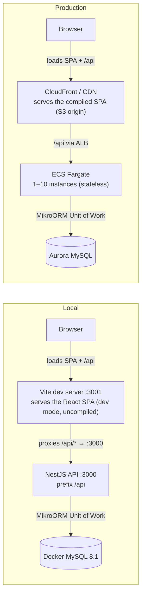
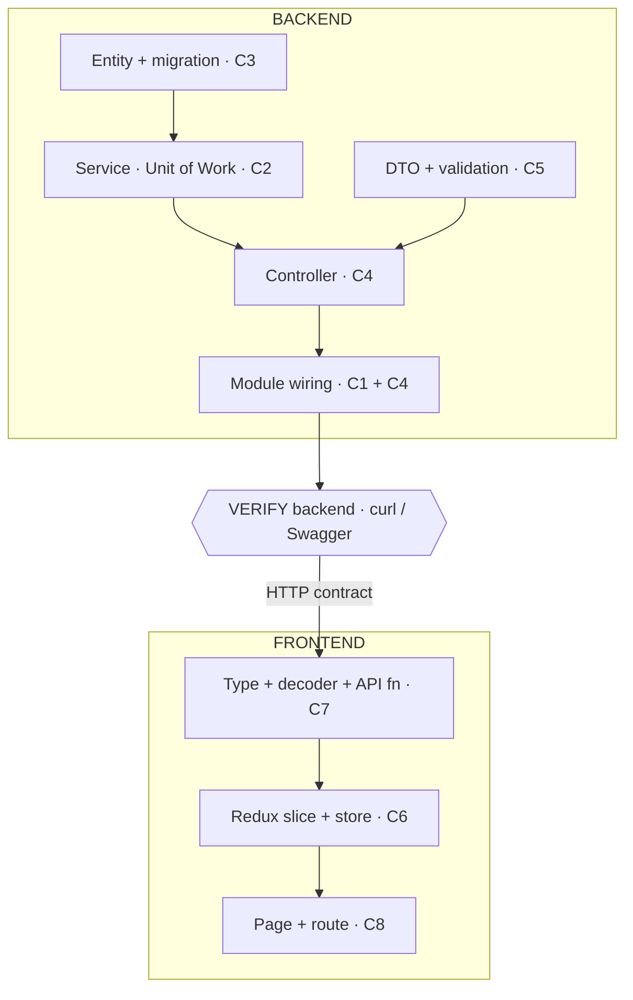

<!-- ===========================================================================
AGENT CONTRACT — KNOWLEDGE BASE (01-COACH.md)
GOVERNED BY: 00-SYSTEM.md (Invariants + routing). Cited rules: [Inv.N].
ROLE: The coach's brain. Canonical store of every technical fact the coach reasons from.
SOURCE OF TRUTH FOR: NestJS/MikroORM mechanics · repo patterns · exact file paths & line
  refs · AWS constraints · the gotchas · concept explanations & examples.
PUT HERE:
  - Any technical fact discovered mid-session not already documented (growth is expected).
  - "How do I X" mechanics and worked examples.
DO NOT PUT HERE:
  - Session questions / clues / scoring / ACs / time budget   -> 03-TUTORIAL.md
  - How the coach talks, grades, or guides                    -> 02-VOICE.md
  - Session sequencing / pointers                             -> 04-PROMPT.md
EDIT POLICY:
  - PLACE BY LOCALITY, not by convenience [Inv.4]: an API fact goes after the frontend section
    and near the top backend layers, far from lower-layer DB/migration facts. The end is right
    only when locality lands there; no fitting section => create one in the right place.
  - SHOW, DON'T TELL: document a behavior/output fact (an error shape, a response payload, a
    transform result, a DDL diff) by SHOWING it — the real code lines PLUS the actual input→output
    (curl + verbatim response, or captured CLI output), never a prose summary the reader must trust
    or reverse-engineer. Capture from the live app or real source; NEVER invent a payload [Inv.2].
  - SHOW BOTH SIDES TOGETHER: when the lesson is "X behaves differently from the default/
    alternative," you MUST show **both outputs together, for the same input**, each independently
    captured and labeled (`// own pipe` vs `// built-in`, `// before` vs `// after`). Showing only
    one side and *asserting* the other "would differ" is a defect — capture the other side too (run
    the default in a throwaway script if it isn't wired). A vague sentence like "errors are flattened
    into a custom shape" is a defect — replace it with the two real shapes side by side.
  - Other files reference these facts; never delete one a dependent file relies on without
    updating that file.
  - Changing any count/label/ordering here triggers the cross-file number sweep [Inv.5].
============================================================================ -->

# 01-COACH — Get fluent in this stack before you start

> **Who this is for.** A senior engineer who knows web architecture, React, SQL, JWTs,
> DTOs, and AWS at the service level — but is **new to NestJS and MikroORM specifically**,
> and wants the **exact deployment constraints** of this app, not a cloud primer.
>
> **What this is.** A map of the genuinely-new surface area plus a teaching contract.
> It introduces each concept at intuition level and names the real file. Ask for any one
> and we go deep, one at a time. I won't re-explain things you already know.

---

## 1. Teaching contract (calibrated to senior)

> **Coaching model:** The full coaching loop — the candidate-driven four beats **Gather → Plan →
> Build → Verify (GPBV)** — is defined in `02-VOICE.md` (cheat-sheet: `05-THE-BUILD-LOOP.md`). That file governs tone, grading voice, quiz discipline,
> and the agentic workflow. Read it before every session — it overrides the older contract below
> where they conflict.

- **Operating model:** I coach from a host terminal and **never write code** — you direct
**Cline inside the Dev Container** to do that (setup + diagram in `setup/01-TUTORIAL_SETUP.md`).
- I assume strong general SWE/web/SQL/cloud background. I **only teach what's new here**:
NestJS idioms, MikroORM's model, this repo's specific patterns, and the precise AWS
deployment shape. I won't define React, REST, JWT, DTO, or "what S3 is."
- **One concept per lesson**, prerequisite-first, and I don't use a *project-specific*
term before introducing it.
- Lessons go **intuition → structure → formalism (real file + tiny example)**, and I stop
between stages until you want more.
- Each lesson ends with a fast check: restate it, or apply it to a one-liner. We don't
advance until it's yours — because in the assessment you must *direct* the AI, and you
can only direct what you understand.

> ✅ You drive depth: *"teach me concept N"*, *"go deeper"*, *"quiz me"*. Default is fast;
> say *"slower"* only where you want it.

---

## 2. The app in context — what it is, how it's shaped, and why

### 2.1 The RealWorld spec

**RealWorld** ([gothinkster/realworld](https://github.com/gothinkster/realworld), "the mother
of all demo apps") is a community **specification**, not a codebase. It defines *one* standard
application — a **Medium.com-style social blogging platform** — together with a fixed REST API
contract and frontend behavior, so the *same* app can be built in any stack. The spec is
implementation-agnostic: any compliant frontend works against any compliant backend.

The feature set the spec mandates:

- **Authentication & profile**
  - Register, log in, log out (token-based)
  - View and edit your own settings/profile
  - View any user's public profile
- **Articles**
  - Create, read, update, delete
  - Fields: `title`, `description`, `body` (markdown), `tagList`, `slug`
  - Paginated listing
- **Feeds**
  - Global feed (all articles)
  - Personal **"Your Feed"** (articles by authors you follow)
  - Filters: by tag, by author, by favorited
- **Social**
  - Comment on an article (add / delete)
  - Favorite / unfavorite an article
  - Follow / unfollow an author
- **Tags**
  - Global popular-tags list (sidebar)
- **Addressing**
  - Each article is keyed by a URL **slug** derived from its title

Because the spec is shared, the same app exists in dozens of stacks (frontends and backends
mix and match freely). A few **React / React Native** front-ended examples:

- React (Redux) + **FastAPI / Pydantic** (Python)
- React + **Ruby on Rails**
- React + **Spring Boot** (Java)
- React + **Go**
- **React Native** (mobile) + any compliant backend
- **Conduit** — *this tutorial*: React/Redux (TypeScript) + **NestJS + MikroORM** (MySQL)

> Full catalog: [codebase.show/projects/realworld](https://codebase.show/projects/realworld).
> (That page is client-rendered, so the list above is drawn from the well-known RealWorld
> implementations, not a live scrape — verify exact repos on the catalog if you want to try one.)

### 2.2 How Conduit implements the spec

**Conduit** is *this repo's* implementation of the RealWorld spec:

- **Frontend** — TypeScript React/Redux (`package.json` name `ts-redux-react-realworld-example-app`)
- **Backend** — NestJS + MikroORM (`nestjs-realworld-example-app`)
- **Database** — MySQL

It fulfils the spec's REST contract — the endpoints you'll touch (`/api/articles/:slug`, comments,
favorite, `profiles/:user/follow`, …) — and exposes them via Swagger at `/docs`.

The app is a representative "enterprise CRUD" sample, and the hidden story ("create and edit
articles") extends its *core* domain — exactly the existing patterns you're studying.

### 2.3 Architecture




*Swagger is served at `:3000/docs` — outside the `/api` prefix and **not** proxied by Vite, so it's reachable only directly at `:3000/docs`, never via `:3001`. Production mirrors the [architecture diagram](instructions/03-architecture-diagram.png) (§6).*

### 2.4 Frontend stack — and the trade-offs behind it

- **No component library, no Storybook, plain CSS** (the shared RealWorld theme). You build
UI by running the app, not in isolation.
- **React 18 + Vite 5 + TypeScript.** Vite for a fast dev server/build (the modern
replacement for Create-React-App).
- **React Router in `HashRouter` mode.**
  - Routing via the URL hash so the built SPA works as *static files* behind CloudFront/S3
  with **zero server-side route config**.
  - Trade-off: `#` URLs (`/#/article/foo` instead of `/article/foo`), in exchange for needing
  no routing infra in prod.
    - *What "routing infra" means:* with clean URLs (`BrowserRouter`), loading a non-home route
    directly — reload, bookmark, or a shared link to `/article/foo` (as opposed to navigating
    to it inside the running app) — makes the CDN look for that path, but no such file exists
    on the host (only `index.html` and the JS/CSS bundles do). So you must configure the host
    to serve `index.html` for unknown paths. Concretely:
      - a CloudFront "custom error response" rewriting 403/404 → `/index.html` (200);
      - an S3 static-site error-document set to `index.html`;
      - or a CloudFront Function / Lambda@Edge that rewrites unmatched paths.
    - *Why `HashRouter` skips all that:* the browser never sends the part after `#` to the
    server, so it always requests just `index.html` and resolves the route client-side — any
    dumb static host works with zero config.
    - *Why it pays off at this size:* Conduit is a client-rendered SPA on S3+CloudFront with no
    SEO/SSR requirement, so ugly URLs cost nothing while you avoid the rewrite config and its
    failure modes.
    - *When it stops being true* — switch to `BrowserRouter` + the rewrite infra once you need:
      - SEO or social/Open-Graph link previews (crawlers never see the hash);
      - server-side rendering or prerendering;
      - clean, canonical, shareable URLs as a product requirement.
- **Redux Toolkit (RTK), used without thunks.**
  - *Why Redux at all?* The app has cross-cutting state — the authenticated user, article
  lists/feeds shared across pages — that several routes read and mutate.
  - Plain `useState`/`useContext` would work, but pushes you toward prop-drilling or several
  ad-hoc contexts with manual re-render control.
  - RTK gives one typed, predictable store + devtools — a slice is typed state + *synchronous*
  reducers (illustrative):
    ```ts
    // articles.slice.ts
    import { createSlice, PayloadAction } from '@reduxjs/toolkit';
    import { Article } from './article.types';

    const articles = createSlice({
      name: 'articles',
      initialState: { items: [] as Article[], loading: false },
      reducers: {
        startLoading: (s) => { s.loading = true; },
        loaded: (s, { payload }: PayloadAction<Article[]>) => {
          s.items = payload; s.loading = false;
        },
      },
    });

    // createSlice auto-generates one action creator per reducer key:
    export const { startLoading, loaded } = articles.actions;
    export default articles.reducer;
    ```
  - *Simplest option?* No — for an app this size, Context-only or a lighter store (e.g.
  Zustand) would be simpler; RTK is the heavier, more conventional, more scalable choice.
  - The repo trims that extra RTK weight by skipping thunks. A **thunk** is:
    - an action creator that returns a *function* instead of a plain action object;
    - the redux-thunk middleware then calls it with `dispatch`/`getState`, so it can do async
    work and fire multiple actions over time;
    - RTK's `createAsyncThunk` is the conventional route, auto-emitting
    pending/fulfilled/rejected actions.
  - Skipping it keeps RTK leaner: async lives in plain `async` functions that
  `store.dispatch()` synchronous actions directly. The payoff:
    - no thunk middleware;
    - no lifecycle-action ceremony (pending/fulfilled/rejected);
    - reducers stay purely synchronous;
    - fewer concepts to learn, read, and test for an app this size.
    ```ts
    import { store } from '../state/store';
    import { startLoading, loaded } from './articles.slice';   // the action creators above
    import { getArticles } from '../services/conduit';         // the API layer (Concept 7)

    // no thunk: async is a plain function that dispatches the sync actions defined above
    async function loadArticles() {
      store.dispatch(startLoading());
      const items = await getArticles();   // plain await — no createAsyncThunk
      store.dispatch(loaded(items));
    }
    ```
- **Runtime validation (`decoders`).** TS types are compile-time only, so an API response
could be any shape at runtime and TS can't catch it. A *decoder* is a runtime validator you
define to mirror the expected type; you run it on the raw response and get back a value
*proven* to match the type — or a clear, early failure.
  ```ts
  // illustrative API — exact syntax is not verified
  import axios from 'axios';
  import { object, string, array, Decoder } from 'decoders';
  import { Article } from './article.types';

  const articleDecoder: Decoder<Article> = object({
    slug:    string,
    title:   string,
    body:    string,
    tagList: array(string),
  });

  // a query just decodes the response and returns the plain value (throws on error):
  async function getArticles(): Promise<Article[]> {
    return array(articleDecoder).verify((await axios.get('/api/articles')).data); // throws on bad shape or HTTP error (axios throws on non-2xx)
  }
  ```
  - Queries like `getArticles`, and simpler mutations like `favoriteArticle`/`followUser`,
  work this way — decode, return the plain value, throw on error (no `Result`).
- **Error handling — `Result` monad (`@hqoss/monads`).** An **error-handling pattern**. Instead of throwing, a fallible call returns a `Result<T, E>`: a wrapper holding *either* `Ok(value)` or `Err(error)`, which the caller must
handle, usually via `.match({ ok, err })`.
  - "Monad" is just the functional-programming (FP) name for a wrap-a-value-and-chain type. The practical point is that **errors become explicit values in the type, not thrown exceptions you might forget to catch**.
  - **Form-style operations** — those that can fail with user-facing validation errors — return `Result<T, GenericErrors>`:
    - the operations: `createArticle`, `updateArticle`, `login`, `signUp`, `updateSettings`;
    - explicit error handling, no `try/catch`; you call `.match()` and supply both branches:
    ```ts
    import { useNavigate } from 'react-router-dom';
    import { createArticle } from '../services/conduit'; // API layer — returns Result
    import { store } from '../state/store';
    import { updateErrors } from './editor.slice';          // action creator (illustrative)

    const navigate = useNavigate(); // from the editor component

    const result = await createArticle(draft); // Result<Article, GenericErrors> (defined below)
    result.match({
      ok:  (article) => navigate(`/article/${article.slug}`), // client-side nav (HashRouter → #/article/…), no reload
      err: (errors)  => store.dispatch(updateErrors(errors)),    // failure → show field errors
    });
    ```
    - The compiler requires *both* `ok` and `err`, so the error case can't be silently
    skipped — that's the safety win over a `try/catch` you can forget to write.
  - How decoder + Result compose: the API call decodes the response into an `Article`, then
  returns `Result<Article, GenericErrors>` — the `Article` is the success payload `T` inside
  `Ok` (plain data, **not** a monad itself).
    ```ts
    import axios, { AxiosError } from 'axios';
    import { Ok, Err, Result } from '@hqoss/monads';
    import { object } from 'decoders';
    import { Article, ArticleDraft, GenericErrors } from './article.types';
    import { articleDecoder, genericErrorsDecoder } from '../services/conduit';

    // illustrative — a mutation that can fail with validation errors, so it returns Result.
    // reuses `articleDecoder` above; `genericErrorsDecoder` mirrors the API error shape.
    async function createArticle(draft: ArticleDraft): Promise<Result<Article, GenericErrors>> {
      try {
        const { data } = await axios.post('articles', { article: draft }); // axios serializes JSON and throws on non-2xx
        return Ok(object({ article: articleDecoder }).verify(data).article);         // success → Ok(decoded Article)
      } catch (error) {
        const axiosError = error as AxiosError;
        return Err(object({ errors: genericErrorsDecoder }).verify(axiosError.response?.data).errors); // failure → Err
      }
    }
    ```

### 2.5 Backend stack — and why

- **NestJS 10.** Opinionated structure (modules + dependency injection + controllers + services)
over bare Express.
  - **Bootstrap.** `main.ts`:
    - builds the app from the root module;
    - mounts the Swagger explorer;
    - starts Express.
    ```ts
    // real, abridged — main.ts
    import { NestFactory } from '@nestjs/core';
    import { DocumentBuilder, SwaggerModule } from '@nestjs/swagger';
    import { AppModule } from './app.module';

    async function bootstrap() {
      const app = await NestFactory.create(AppModule, { cors: true }); // builds the app from the root module,
                                                                        // registering controllers' routes on the Express adapter
      app.setGlobalPrefix('api');                      // → /api/articles

      const options = new DocumentBuilder()
        .setTitle('NestJS Realworld Example App')
        .setDescription('The Realworld API description')
        .setVersion('1.0')
        .addBearerAuth()
        .build();
      const document = SwaggerModule.createDocument(app, options);
      SwaggerModule.setup('/docs', app, document);     // API explorer at /docs (outside /api prefix)

      await app.listen(3000);
    }
    ```
  - **`AppModule`.** The composition root Nest bootstraps from (`NestFactory.create(AppModule)`). It defines no routes itself — it **imports the feature modules** (`ArticleModule`, `UserModule`, …) and global infrastructure (`MikroOrmModule.forRoot`), assembling them into one app; Nest starts here and recursively wires everything imported. It also wires the request-scoped MikroORM middleware and runs migrations on boot.
    ```ts
    // real, abridged — app.module.ts
    import { MiddlewareConsumer, Module, NestModule, OnModuleInit } from '@nestjs/common';
    import { MikroORM } from '@mikro-orm/core';
    import { MikroOrmMiddleware, MikroOrmModule } from '@mikro-orm/nestjs';
    import { AppController } from './app.controller';
    import { ArticleModule } from './article/article.module';
    import { UserModule } from './user/user.module';
    import { ProfileModule } from './profile/profile.module';
    import { TagModule } from './tag/tag.module';
    import ormConfig from '../mikro-orm.config';

    @Module({
      controllers: [AppController],
      imports: [MikroOrmModule.forRoot(ormConfig), ArticleModule, UserModule, ProfileModule, TagModule],
      providers: [],
    })
    export class AppModule implements NestModule, OnModuleInit {
      constructor(private readonly orm: MikroORM) {}

      async onModuleInit() {
        await this.orm.getMigrator().up(); // runs pending migrations on every boot (idempotent)
      }

      configure(consumer: MiddlewareConsumer) {
        consumer.apply(MikroOrmMiddleware).forRoutes('*'); // request-scoped EM for all routes
      }
    }
    ```
  - **Module + DI.** Each feature module registers its controllers + providers; Nest constructs and injects them:
    ```ts
    // real, abridged — article.module.ts
    import { Module, NestModule } from '@nestjs/common';
    import { MikroOrmModule } from '@mikro-orm/nestjs';
    import { ArticleController } from './article.controller';
    import { ArticleService } from './article.service';
    import { Article } from './article.entity';
    import { Comment } from './comment.entity';
    import { User } from '../user/user.entity';
    import { UserModule } from '../user/user.module';

    @Module({
      controllers: [ArticleController],  // Nest scans these for @Get/@Post route decorators
      providers: [ArticleService],       // injectable — Nest constructs and injects into the controller (DI)
      imports: [MikroOrmModule.forFeature({ entities: [Article, Comment, User] }), UserModule],
    })
    export class ArticleModule implements NestModule { /* auth middleware wiring */ }
    ```
  - **Auth — custom JWT middleware.** Wired **per-module** via `forRoutes(...)`:
    ```ts
    // real, abridged — article.module.ts
    import { MiddlewareConsumer, Module, NestModule, RequestMethod } from '@nestjs/common';
    import { AuthMiddleware } from '../user/auth.middleware';

    export class ArticleModule implements NestModule {
      configure(consumer: MiddlewareConsumer) {
        consumer
          .apply(AuthMiddleware)
          .forRoutes(
            { path: 'articles/feed', method: RequestMethod.GET },
            { path: 'articles', method: RequestMethod.POST },
            { path: 'articles/:slug', method: RequestMethod.DELETE },
            // … other protected article routes
          );
      }
    }
    ```
    - **Why `configure()` + `forRoutes`?**
      - NestJS has no middleware *decorator* — middleware is registered **imperatively**.
      - A module implements `NestModule`, so Nest calls its `configure(consumer)` at startup.
      - `consumer.apply(AuthMiddleware).forRoutes(...)` binds the middleware onto the listed routes of the Express adapter.
      - It runs before guards/pipes/the handler.
    - **You list only the *protected* routes** — `forRoutes` is selective, not all-or-nothing:
      - Public routes (`GET /articles`, `GET /articles/:slug`) are left out, so the middleware never runs for them.
      - That's why `GET /articles`'s `@User('id')` is `undefined` for anonymous callers.
      - Instead of enumerating, you can target a whole controller (`forRoutes(ArticleController)`) or a path pattern with `.exclude(...)`.
  - **`AuthMiddleware` verifies the JWT** and attaches the user to the request; the `@User()` param decorator reads it:
    ```ts
    // real, abridged — backend/src/user/auth.middleware.ts
    import { HttpException, HttpStatus, Injectable, NestMiddleware } from '@nestjs/common';
    import { NextFunction, Request, Response } from 'express';
    import jwt from 'jsonwebtoken';
    import { SECRET } from '../config';
    import { UserService } from './user.service';

    @Injectable()
    export class AuthMiddleware implements NestMiddleware {
      constructor(private readonly userService: UserService) {}

      async use(req: Request & { user?: any }, res: Response, next: NextFunction) {
        const token = (req.headers.authorization as string)?.split(' ')[1];
        if (!token) throw new HttpException('Not authorized.', HttpStatus.UNAUTHORIZED);

        const decoded = jwt.verify(token, SECRET) as { id: number }; // verify the JWT
        const user = await this.userService.findById(decoded.id);    // load the user
        if (!user) throw new HttpException('User not found.', HttpStatus.UNAUTHORIZED);

        req.user = user.user;        // attach to the request — @User() reads this
        req.user.id = decoded.id;
        next();
      }
    }
    ```
  - **Controller.** The HTTP entry layer — declares routes via decorators and delegates to the service:
    - **Routing is decorator-based, not bare Express.** `@Controller('articles')` + `@Get()` declare the route; with the global `/api` prefix it mounts `GET /api/articles`.
    - **`@User('id')`** — a param decorator injecting the authenticated user's id from the request (not a URL segment).
    - **`@Query()`** — a param decorator injecting the query-string filters (`?limit=…&offset=…`).
    - **Thin layer** — returns the `IArticlesRO` Response Object value; Nest serializes it to the `{ articles, articlesCount }` JSON the frontend decoder expects.
    ```ts
    // real, abridged — backend/src/article/article.controller.ts
    import { Controller, Get, Query } from '@nestjs/common';
    import { User } from '../user/user.decorator';
    import { ArticleService } from './article.service';
    import { IArticlesRO } from './article.interface';

    @Controller('articles')
    export class ArticleController {
      constructor(private readonly articleService: ArticleService) {}

      @Get()
      async findAll(
        @User('id') userId: number,
        @Query() query: Record<string, string>,
      ): Promise<IArticlesRO> {
        return this.articleService.findAll(+userId, query);
      }
    }
    ```
  - **ValidationPipe — request-boundary validation.** Input validation fires at the **request boundary**, not at persistence:
    - **First, `@Body('article')` unwraps the envelope.** The argument *scopes* the decorator to
    one property: `@Body()` (bare) hands the handler the **entire** request body, while
    `@Body('article')` reaches in and binds only `body.article` — roughly `request.body['article']`.
    That strips the RealWorld envelope so the handler works directly with the DTO:
      ```
      POST body  ─►  { "article": { …fields } }
                              │
                  @Body('article')
                              │
                              ▼
                  articleData: CreateArticleDto = { …fields }
      ```
      - A missing `article` key yields `undefined`. Same pattern as `@User('id')` (pulls `id` off
      the attached user) and `@Param()` (all route params) in that very `update` signature.
      - The DTO type is a *compile-time* annotation only — `@Body('article')` does no validation by
      itself; that's the pipe's job (next bullet), which runs on the **extracted** object. You can
      even attach it inline as a second arg: `@Body('article', new ValidationPipe())`.
    - When Nest binds the request body to the handler's `@Body()` DTO param, the `ValidationPipe` runs the DTO's `class-validator` rules **before** the controller handler body executes.
    - On failure it throws `HttpStatus.BAD_REQUEST` (400) — the handler, the service, and the
    `EntityManager` never run. (The RealWorld convention for validation failures is
    `HttpStatus.UNPROCESSABLE_ENTITY` (422); refactoring the pipe to return it is a *suggested*
    improvement to record in `plan.md` and have Cline execute — not the stock behavior.)
    - Entities map persistence; they don't validate — **this** does.
    - Applied **opt-in per handler** via `@UsePipes(new ValidationPipe())` (not global). There's
    no app-wide pipe and no module binding — a pipe attaches to a **specific controller route**
    by decorating that handler method; an undecorated handler runs **no** validation.
      - In Conduit, `@UsePipes(new ValidationPipe())` decorates exactly **two** handlers, both in
      `user.controller.ts`: `create` (`POST /users`, registration) and `login` (`POST /users/login`).
      Every other handler — including all of `article.controller.ts` — has none, which is why
      **article create/update validate nothing** (the §7 gotcha).
        ```ts
        // real, abridged — backend/src/user/user.controller.ts
        import { Body, Controller, Post, Put, UsePipes } from '@nestjs/common';
        import { ValidationPipe } from '../shared/pipes/validation.pipe';

        @Controller()
        export class UserController {
          @UsePipes(new ValidationPipe())   // ← the method decorator: attaches the pipe to THIS route only
          @Post('users')
          async create(@Body('user') userData: CreateUserDto) {  // CreateUserDto validated before this body runs
            return this.userService.create(userData);
          }

          @UsePipes(new ValidationPipe())
          @Post('users/login')
          async login(@Body('user') loginUserDto: LoginUserDto) { /* ... */ }

          @Put('user')                      // ← NO @UsePipes → UpdateUserDto is never validated
          async update(@Body('user') userData: UpdateUserDto) { /* ... */ }
        }
        ```
    - **`@UsePipes` vs `@Body('article', pipe)` — same validation, different binding scope.** A
    common misread is "`@UsePipes` validates `request.body`, the inline arg validates a property."
    Not so — **a pipe never sees `request.body`.** It runs **per parameter**, on the value that
    param's decorator already extracted, with that param's declared type as `metatype`. So both
    forms below validate the **same extracted `body.user` object** against `CreateUserDto`:
      ```ts
      @UsePipes(new ValidationPipe())                          // bound to the whole handler
      async create(@Body('user') userData: CreateUserDto) {}  // pipe runs on body.user
      
      // pipe also runs on body.user
      async create(@Body('user', new ValidationPipe()) userData: CreateUserDto) {} // bound to one param
      ```                                                                             
      
      - Two **orthogonal** choices are in play — don't conflate them:
        - **Extraction** — `@Body()` (whole body) vs `@Body('user')` (just `body.user`). *This* arg
        decides **what value** is validated.
        - **Binding** — `@UsePipes(pipe)` (every param of the handler) vs `@Body('user', pipe)` (that
        one param). *This* decides **where the pipe attaches**.
      - "Every param" sounds broad, but the repo's pipe calls `toValidate(metatype)` and returns
      primitives/`Object` untouched. So on `create(@User('id') id, @Param() p, @Body('user') dto)`,
      `@UsePipes` effectively validates only the DTO param anyway — `id` and `p` pass straight through.
    - **When to use which:**
      - **`@UsePipes(new ValidationPipe())`** — the handler has **one** body DTO to validate (the
      common case), or you want **one** pipe to cover several params at once. It's the repo's choice
      for `create`/`login`. Reads as "validate this route":
        ```ts
        @UsePipes(new ValidationPipe())
        @Post('articles')
        async create(@User('id') userId: number, @Body('article') dto: CreateArticleDto) {
          return this.articleService.create(userId, dto);   // dto (= body.article) validated; userId untouched
        }
        ```
      - **`@Body('article', new ValidationPipe())`** — the inline form binds the pipe to **one
      param** (use it only when different params need different pipes). The repo **never** uses it —
      `grep` finds no `@Body(_, pipe)` or `@Param(_, pipe)` anywhere in `backend/src` — so `@UsePipes`
      is the grounded choice. Here's the **real** `update` handler today, with no pipe (the §7 gap):
        ```ts
        // real — backend/src/article/article.controller.ts
        @Put(':slug')
        async update(
          @User('id') user: number,
          @Param() params: Record<string, string>,
          @Body('article') articleData: CreateArticleDto,   // ← no pipe today → no validation
        ) {
          return this.articleService.update(+user, params.slug, articleData);
        }
        ```
        Two equivalent ways to validate `articleData` against `CreateArticleDto` — same result,
        different binding scope:
        ```ts
        @UsePipes(new ValidationPipe())                                  // whole-handler binding — the repo's pattern
        // …or scoped to the single param, inline:
        @Body('article', new ValidationPipe()) articleData: CreateArticleDto
        ```
      - Rule of thumb: **`@UsePipes` for the whole route, the inline arg for a single argument.**
      For Conduit's handlers — one body DTO each — `@UsePipes` is the idiomatic pick; reach for the
      inline form only when params need to be validated differently.
    - **It's the repo's *own* pipe, not `@nestjs/common`'s.** Import the default and the feature
    breaks — and the reason is *observable*, so here it is shown, not asserted.
      ```ts
      // real, abridged — backend/src/shared/pipes/validation.pipe.ts
      import { Injectable, PipeTransform, ArgumentMetadata, BadRequestException, HttpException, HttpStatus, ValidationError } from '@nestjs/common';
      import { plainToClass } from 'class-transformer';
      import { validate } from 'class-validator';

      @Injectable()
      export class ValidationPipe implements PipeTransform<unknown> {
        async transform(value: unknown, metadata: ArgumentMetadata) {
          if (!value) throw new BadRequestException('No data submitted');   // ① empty body → reject
          const { metatype } = metadata;
          if (!metatype || !this.toValidate(metatype)) return value;        // skip String/Number/Array/Object params
          const object = plainToClass(metatype, value);
          const errors = await validate(object);                            // run the DTO's class-validator rules
          if (errors.length > 0) {
            throw new HttpException(
              { message: 'Input data validation failed', errors: this.buildError(errors) }, // ② custom shape
              HttpStatus.BAD_REQUEST,
            );
          }
          return value;                                                     // ③ returns the RAW value, not `object`
        }
        private buildError(errors: ValidationError[]): Record<string, string> {
          const result: Record<string, string> = {};
          errors.forEach((el) => {
            Object.entries(el.constraints ?? []).forEach((c) => { result[el.property + c[0]] = `${c[1]}`; });
          });                          // key = field name + constraint name (e.g. "title" + "isNotEmpty")
          return result;
        }
        private toValidate(metatype: unknown): boolean {
          return ![String, Boolean, Number, Array, Object].includes(metatype as any);
        }
      }
      ```
      Three behaviors the default `@nestjs/common` pipe does **not** give you. Each is shown against
      the **live `user` endpoints** (which already run this pipe), curl + verbatim response:

      **① Empty body → rejected outright** with one clean message. `POST {}` makes `@Body('user')`
      extract `body.user` = `undefined`; the two pipes diverge immediately:
      ```bash
      curl -s -X POST localhost:3000/api/users -H 'Content-Type: application/json' -d '{}'
      ```
      ```jsonc
      // own pipe (HTTP 400) — short-circuits on the falsy value, one clear message:
      {"message":"No data submitted","error":"Bad Request","statusCode":400}

      // built-in @nestjs/common ValidationPipe (HTTP 400) — no guard: validates an empty instance,
      // returns a per-field message ARRAY, no `errors` key  [captured, NestJS 10.4.15, same DTO]:
      {"message":["username should not be empty","email should not be empty","password should not be empty"],"error":"Bad Request","statusCode":400}
      ```

      **② class-validator errors → flattened into a custom `errors` object.** Same request, empty
      fields:
      ```bash
      curl -s -X POST localhost:3000/api/users -H 'Content-Type: application/json' \
        -d '{"user":{"username":"","email":"","password":""}}'
      ```
      ```jsonc
      // own pipe (HTTP 400) — `message` + an `errors` MAP keyed by field+constraint name:
      {"message":"Input data validation failed",
       "errors":{"usernameisNotEmpty":"username should not be empty",
                 "emailisNotEmpty":"email should not be empty",
                 "passwordisNotEmpty":"password should not be empty"}}

      // built-in @nestjs/common ValidationPipe (HTTP 400) — NO `errors` key, `message` is a flat
      // ARRAY of strings  [captured, NestJS 10.4.15, same DTO]:
      {"message":["username should not be empty","email should not be empty","password should not be empty"],"error":"Bad Request","statusCode":400}
      ```
      > **This is the difference that breaks the feature.** The frontend decodes every error response
      > with `object({ errors: genericErrorsDecoder })` (`frontend/src/services/conduit.ts:41,64,74,84,99`)
      > — it **requires an `errors` key**. The default shape has none, so the decoder rejects the
      > payload, the error never reaches the editor's `.match({ err })` branch, and the field error
      > never renders → **AC3 fails** (silent failure; see `03-TUTORIAL.md` AC list). Importing the
      > wrong pipe is a Correctness bug, not a style nit.
      >
      > **Confirmed seam (source + live curl) — the per-field error path is broken today, and the bug
      > is shared with the user endpoints.** Three shapes that don't agree:
      > - **Decoder** (`frontend/src/types/error.ts:3,5`): `genericErrorsDecoder = dict(array(string))`
      >   → every value must be a **`string[]`**.
      > - **Renderer** (`frontend/src/components/Errors/Errors.tsx:6-9`): `fieldErrors.map(...)` — so it
      >   *also* assumes arrays, and prints the **compound key** verbatim (`{field} {fieldError}`),
      >   never unwrapping `usernameisNotEmpty` → `username`.
      > - **Backend, live** (`curl POST /api/users` with empty fields):
      >   `{"errors":{"usernameisNotEmpty":"username should not be empty", …}}` → **string** values.
      >
      > `decoders` does **not** coerce: `array(string).verify("…")` **throws** (a string is not an
      > array). The throw fires *inside* the `catch` of `createArticle`/`updateArticle`
      > (`conduit.ts:84,99`) — and `login`/`signUp`/`updateSettings` (`:41,64,74`) — so it escapes
      > unhandled, `.match({ err })` never runs, and field errors never render → **AC3 fails**. Because
      > the pipe is shared, the *shipped MVP's* user validation carries the same latent bug — **"it
      > shipped" is not "it works"** (nobody exercised it with empty input). Fix: make `buildError`
      > emit `{ [field]: [message] }` — a `string[]` keyed by the **bare field** (shared-pipe blast
      > radius: the user endpoints too, which it also fixes) — or change the decoder + `<Errors>` to
      > the string/compound shape. This is a `plan.md` Decision and a real Correctness item.

      **③ Returns the *raw* value, not the class instance.** `transform` runs `plainToClass(...)`
      only to validate, then `return value` — the original plain object. Downstream handlers get the
      plain object; the default pipe with `transform: true` would hand on a real DTO instance instead.
    - **Wired declaratively on the handler** — contrast `AuthMiddleware`, which is wired
    imperatively per-**module** via `configure(consumer).forRoutes(...)`. Both are per-route and
    selective, but the pipe is a method decorator and the middleware is a module binding:
    ```ts
    // illustrative — input rules live on the DTO, validated by the pipe
    import { IsNotEmpty, MaxLength, MinLength } from 'class-validator';

    export class CreateArticleDto {
      @IsNotEmpty() @MinLength(5) @MaxLength(100)
      title: string;

      @IsNotEmpty()
      body: string;
    }
    ```
  - **Service** — a NestJS **provider**: `@Injectable()`, constructed once by DI and injected into the controller; it's injected an `EntityManager` + an `EntityRepository`. Methods shown as stubs:
    ```ts
    import { Injectable } from '@nestjs/common';
    import { InjectRepository } from '@mikro-orm/nestjs';
    import { EntityManager } from '@mikro-orm/core';
    import { EntityRepository } from '@mikro-orm/mysql';
    import { Article } from './article.entity';

    @Injectable()
    export class ArticleService {
      constructor(
        private readonly em: EntityManager,
        @InjectRepository(Article) private readonly articleRepository: EntityRepository<Article>,
      ) {}

      findAll(userId: number, query: Record<string, string>) { /* … query via repository */ }
      favorite(id: number, slug: string) { /* … mutate + em.flush() */ }
    }
    ```
- **MikroORM 5.7 (Unit of Work + Identity Map).** A *data-mapper* ORM — you work with
decorator-mapped entities and relations rather than writing SQL; migrations are hand-registered.
  - **Repository** — `EntityRepository<T>`: MikroORM's typed data-access for ONE entity, a thin wrapper over the `EntityManager`. Specific methods:
    ```ts
    import { EntityRepository } from '@mikro-orm/mysql';

    const articles: EntityRepository<Article>;
    articles.findOne({ slug });        // one by criteria
    articles.find({ author });         // many by criteria
    articles.findOneOrFail(id);        // throws if missing
    articles.count({ author });        // count rows
    articles.createQueryBuilder('a');  // complex queries
    // persist(entity) / remove(entity) register changes for the next flush
    ```
  - **Unit of Work** — the `EntityManager` tracks managed entities (Identity Map). Mutate them, then `flush()` ONCE → it diffs the Identity Map and writes the change set in one transaction. The specific bit:
    ```ts
    import { EntityManager } from '@mikro-orm/core';

    // article & user are managed entities (loaded via the repository)
    user.favorites.add(article);   // mutate — no INSERT yet
    article.favoritesCount++;      // mutate — no UPDATE yet
    await em.flush();              // ONE flush: EM diffs the Identity Map → one transaction
    ```
  - **Entity** — a decorated class mapped to a table: `@Entity()`, `@PrimaryKey`, `@Property`, relations, and `ArrayType` for the inline tag list:
    ```ts
    // real, abridged — backend/src/article/article.entity.ts
    import {
      ArrayType,
      Collection,
      Entity,
      ManyToOne,
      OneToMany,
      PrimaryKey,
      Property,
    } from '@mikro-orm/core';
    import { User } from '../user/user.entity';
    import { Comment } from './comment.entity';

    @Entity()
    export class Article {
      @PrimaryKey({ type: 'number' })
      id: number;

      @Property({ fieldName: 'title' })
      title: string;

      @Property({ fieldName: 'body' })
      body = '';

      @Property({ type: ArrayType, fieldName: 'tag_list' })
      tagList: string[] = [];

      @ManyToOne(() => User, { fieldName: 'author_id' })
      author: User;

      @OneToMany(() => Comment, (c) => c.article, {
        eager: true,
        orphanRemoval: true,
        // cascade rules go here, e.g. cascade: [Cascade.PERSIST, Cascade.REMOVE]
      })
      comments = new Collection<Comment>(this);

      @Property({ type: 'number', fieldName: 'favorites_count' })
      favoritesCount = 0;
    }
    ```
  - **Persistence config (`mikro-orm.config.ts`).** One `defineConfig` holds the connection *and* the migration registry:
    - **Connection** — driver + `host`/`port`/`user`/`password`/`dbName`, all **hardcoded** (no env mechanism):
      - `host: 'db'` is the Docker **service** hostname. It resolves unchanged in both Codespaces and a local Dev Container, because the `app` container shares the `db` service's network namespace (`network_mode: service:db`) — so you run the harness **as shipped, no edit**. (You'd only change it to `'localhost'` to run Node *outside* the container, which means you've left the harness — don't.)
      - For Aurora prod the whole connection should come from **env vars** (per environment), not be hardcoded — `host`, `user`, `password`, `dbName` (and the JWT secret):
        - raw `process.env.DB_HOST` is untyped (`string | undefined`) and unvalidated — a missing or typo'd var fails late;
        - prefer a **validated env layer** — `envalid` (or a zod/joi schema) — that parses, types, and fail-fasts at startup.
        - `@nestjs/config`'s `ConfigService` **can't** load/validate/inject env vars here — it's a **DI provider** that exists only *after* `NestFactory.create()` boots the Nest container, but the **CLI never boots Nest** (it just `import`s this file to run a migration) and the file runs at plain import time → no container, no `ConfigService`. Read env at import instead (`envalid` / `process.env`).
      ```ts
      // real, abridged — mikro-orm.config.ts (connection)
      import { defineConfig } from '@mikro-orm/mysql';

      export default defineConfig({
        host: 'db',            // 'db' = the MySQL service on the devcontainer network (Codespaces or local Dev Container); Aurora endpoint in prod
        port: 3306,
        user: 'conduit',
        password: 'conduit',
        dbName: 'conduit',
        registerRequestContext: false, // Nest owns the request context via MikroOrmMiddleware; don't double-register
        // entities / migrations / discovery → see "Migrations" below
      });
      ```
    - **This config file is shared by two consumers** (a real friction point, not a project quirk):
      - **The MikroORM CLI** (`migration:create` / `migration:up` / `schema:update`) runs as a **standalone Node process** — no app, no Nest, no DI container. It **imports this file directly**.
      - **The NestJS app** loads the **same** file via `MikroOrmModule.forRoot()`; MikroORM then joins the **Nest DI container**, injecting `EntityManager`/`EntityRepository` into services.
      ```mermaid
      flowchart TB
        CFG["<b>mikro-orm.config.ts</b><br/>plain module · DI-less · one source of truth"]
        subgraph MIG["CLI · migrations (no app · no DI)"]
          direction TB
          M1["migration:create"] --> M2["migration:up<br/>(apply pending)"]
          M2 -.->|rollback| M3["migration:down<br/>(revert last)"]
        end
        subgraph SCH["CLI · schema (no app · no DI)"]
          direction TB
          S1["schema:update<br/>(alter DB to match entities)"]
          S2["schema:fresh<br/>(drop + recreate)"]
          S1 ~~~ S2
        end
        subgraph APP["NestJS app · runtime DI"]
          direction TB
          A1["MikroOrmModule.forRoot()"] --> A2["MikroORM joins the<br/>Nest DI container"] --> A3["EntityManager / EntityRepository<br/>injected into services"]
        end
        CFG -->|imported by the CLI| MIG
        CFG -->|imported by the CLI| SCH
        CFG -->|imported by forRoot| APP
      ```
      - **What you actually type** — the subcommands above aren't runnable on their own; you invoke the `@mikro-orm/cli` binary, **run from `backend/`** so it auto-discovers `mikro-orm.config.ts`:
        ```bash
        # from backend/ — the CLI imports mikro-orm.config.ts directly (no Nest, no DI)
        npx mikro-orm migration:create        # diff entities → new migration .ts in pathTs
        npx mikro-orm migration:up            # apply pending
        npx mikro-orm migration:down          # revert the last one
        npx mikro-orm schema:update --run     # alter DB to match entities (--dump to print SQL, don't run)
        ```
        - **This project ships no migration npm script** — the only ORM script is `npm run seed` (`mikro-orm seeder:run`), and migrations **auto-run on app boot** via `migrator.up()` in `AppModule.onModuleInit`. So `npx mikro-orm …` is the *only* way to drive them by hand; if asked live, name the binary, not just the subcommand.
      - **`schema:*` (fileless alt)** — **driven by your entities**: they diff entity metadata against the live schema and apply DDL directly (so `schema:update`/`fresh` **do** read the DB to compute the diff — `schema:create --dump` is the exception that reads only the entities). Which command reads entity vs live DB vs writes: see the table in §2.8.
        - **`schema:update`** — alter the DB to match entities;
        - **`schema:fresh`** — drop + recreate;
        - **`--dump`** — print the SQL instead of running it (`schema:create --dump` = entity-derived; `schema:update --dump` = entity-vs-live diff).
    - **Migrations — bundled vs unbundled.** How MikroORM *finds* migration files depends on the deploy shape:
      ```ts
      // real, abridged — mikro-orm.config.ts (entities + migrations)
      import { InitialMigration } from './src/migrations/InitialMigration';
      import { User } from './src/user/user.entity';
      import { Tag } from './src/tag/tag.entity';
      import { Article } from './src/article/article.entity';
      import { Comment } from './src/article/comment.entity';

      export default defineConfig({
        // ...connection (above)
        entities: [User, Tag, Article, Comment],          // hand-listed → bundle-safe
        discovery: { disableDynamicFileAccess: true },    // true → no glob; default false globs folders
        migrations: {
          migrationsList: [{ name: 'InitialMigration', class: InitialMigration }],  // bundle-safe
          // unbundled glob alt — drop migrationsList, point at folders ('./' = process.cwd()):
          //   pathTs: './db/migrations'       (.ts source; where migration:create writes)
          //   path:   './dist/db/migrations'  (compiled .js; prod)
        },
      });
      ```
      - **Default — DynamicFileAccess (unbundled deploys).** Out of the box, MikroORM discovers migrations by **reading folders**: `migration:create` writes a `.ts` file into `pathTs`, and `migration:up` reads the compiled `.js` from `path`. This works wherever the **source tree survives after deploy** — Fargate, Heroku, a normal container.
      - **Serverless — bundled deploys (Lambda / Vercel).** A bundler inlines the source into **one artifact**, so the migration folders **vanish** — MikroORM can no longer glob them to find pending migrations. Setting **`disableDynamicFileAccess: true` + a hand-listed `migrationsList`** fixes it by registering migrations **explicitly**.
      - **The bundle-safe config is the most flexible.** `disableDynamicFileAccess: true` + `migrationsList` works in **both** bundled *and* unbundled deploys. The default is `disableDynamicFileAccess: false`, so you must set it explicitly to keep the deployment strategy flexible.
      - **Either way, `migrator.up()` must run from a single runner** — a separate deploy step or one-off task, **not** every instance's boot. With multiple instances, concurrent boots race to apply the same pending migration, and **MySQL DDL auto-commits** (no rollback); the `mikro_orm_migrations` table only skips *already-applied* migrations — it doesn't serialize concurrent runners.
    - **Migration (anatomy)** — a TS class extending `Migration`: `up()` emits DDL via `addSql(...)`, and `down()` reverses it:
      ```ts
      // real, abridged — backend/src/migrations/InitialMigration.ts
      import { Migration } from '@mikro-orm/migrations';

      export class InitialMigration extends Migration {
        async up(): Promise<void> {
          this.addSql('create table `user` (...) ...;');
          this.addSql('create table `article` (...) ...;');
          // ... more tables + FK constraints
        }
        async down(): Promise<void> { 
          this.addSql('drop table if exists `article`;'); 
        }
      }
      ```
      - **Applying them** — `npx mikro-orm migration:up` runs *pending* migrations only (idempotent; tracked in the `mikro_orm_migrations` table). Run it from a **single runner** (a deploy step / one-off task). *This repo* instead wires it to **every boot** (`AppModule.onModuleInit()` → `migrator.up()`) — convenient for one instance, a footgun at 1–10.
      - **Rolling back** — `npx mikro-orm migration:down` runs the migration's `down()` — invoked manually from a single runner, **never** automatically.
      - **Designing `down()` for a one-way / widening migration (Q5 rollback-safety).** When `up()` is
        **backward-compatible** — a *widening* like `varchar(255)`→`text`, where every old value still
        fits and the pre-migration code works against the new column — the auto-generated `down()`
        (`text`→`varchar(255)`) is the dangerous part: once long bodies exist it either **fails**
        (strict mode, Error 1406) or **truncates** (data loss). Two defensible designs:
        - **No-op `down()`** (comment out the revert) — the right call *here*: a rollback proceeds and
          harmlessly leaves the wider column; the old code doesn't care. A no-op down also makes
          re-applying `up()` clean (it's idempotent on an already-`text` column).
        - **Throwing `down()`** (`throw new Error('not reversible — restore from backup')`) — reserve
          for migrations whose un-reverted state is **incompatible** (old code breaks against the new
          schema), where you *want* to block the rollback loudly. **Do not** use a throw for a benign
          widening — it crashes a legitimate rollback over a harmless state.
        The deciding question is **"is the un-reverted state compatible with the old code?"** — yes →
        no-op; no → throw. (Either way, record the decision in `plan.md`, as in this session.)

### 2.6 How you actually develop it

- **Do you need the backend running to build the frontend?** For anything with data, **yes** —
there are no mocks/MSW; the frontend calls `/api/` (base in `frontend/src/config/settings.ts`),
which Vite proxies to `:3000`. Components render without it, but every data screen errors.
Run both.
- **Storybook?** No. Develop UI against the running app.
- **Can you exercise the backend without the frontend?** Yes — **Swagger UI at
[http://localhost:3000/docs](http://localhost:3000/docs)** is the endpoint explorer; or use `curl`. There is **no Postman
collection / `.http` file** in the repo, so Swagger or curl is the way to drive the API
directly.
- **Agentic FE/BE: parallel or sequential?** Frontend and backend are decoupled by the **HTTP
contract** (the route + request/response JSON shapes).
  - Once that contract is fixed, an agent could build each side independently and verify the
  backend via Swagger/curl.
  - Practically, since you'll drive one Cline serially, the reliable order is: **define the
  contract → build and verify the backend → build the frontend against it** (the order
  `03-TUTORIAL.md` follows).

### 2.7 The opinionated bits that will bite if you assume defaults

- **Unit-of-Work persistence** — you `flush()`, you rarely write SQL.
- **HTTP lives at the boundary, not in services.** Pipes and middleware already throw
  `HttpException`; services only `flush()` and return data. Keep that separation: map a persistence
  exception (e.g. a DB unique violation) to an HTTP response in an **exception filter** at the
  boundary — **never** by throwing `HttpException` from a service. Catching *inside* a service is a
  layering smell unless the catch makes a **domain** decision (on conflict → load & return the
  existing row = upsert), not response formatting. Locality/convenience is not the goal; the
  service↔HTTP boundary is. (Worked through in §7 item 6.)
- **Auth is custom middleware + a `@User()` decorator**, not guards.
- **Validation is opt-in per endpoint** — article endpoints validate nothing today.
- **Migrations are hand-registered** in `mikro-orm.config.ts` — no glob discovery.
- **No-thunk Redux + runtime-decoded responses + `Result` monad** on the frontend.
- **`axios` over `fetch`** — `fetch` resolves on any HTTP response including 4xx/5xx; axios throws on non-2xx, so HTTP errors are caught in the same `try/catch` as network failures and decoder errors. That single error path is why queries can be a one-liner and mutations can return `Result` without a manual `res.ok` check.

The rest of this file expands each of these and points at the real file.

### 2.8 Driving Cline — operational facts (consolidated)

*How to **operate** the agent — prompt **content**/anatomy lives in `02-VOICE.md` §"Agentic
skills". Kept together here so the driving facts are one lookup.*

- **One Cline, driven serially** — build contract → backend → frontend, one session per
  implementation phase to keep diffs reviewable (§2.6).
- **Cline runs commands in the dev-container shell — its prompt is `root@<container-id>:/workspace#`.**
  When a verification/command log shows that prompt, that **IS Cline executing** (the candidate
  driving it), **not** the candidate's host terminal. Do **not** misread it as manual execution and
  dock AI Usage — confirm how it was run before scoring (a curl/node round-trip with that prompt is a
  Cline-run, graded-positive event). *Coach misjudged this once — 2026-06-12.*
- **Command-approval discipline — review every command before it runs; it's where you catch a bad
  one.** Cline shows the exact command it's about to execute and waits for approval. Treat that gate
  as a real review, never a rubber stamp. The loop for every Cline interaction:

  ```
  prompt → review what Cline proposes (command or edit)
        → reject & refine if wrong — e.g. an escaped `&amp;&amp;`, a chained/redirected command;
          suggest the operator-free form Cline can run
        → approve
        → review Cline's response/output (the diff, or the command result)
  ```

  The escaped-`&&` failure (next bullet) is **visible at the review step, before it ever reaches
  bash** — that is the moment to reject and hand Cline the operator-free alternative (split
  commands / `;` / `-o`). So **don't blind-auto-approve command execution**: leaving `Read`/`Edit`
  on auto is fine, but keep eyes on commands. (Velocity trade-off: a two-second review beats a
  baffling mid-clock stall on a command bash refuses to parse.)
- **Cline HTML-escapes shell metacharacters → DON'T CHAIN COMMANDS.** Before handing a command to
  the shell, Cline encodes `& < > " '`, so `&&` reaches bash as the literal `&amp;&amp;` →
  `bash: syntax error near unexpected token ';&'`, and the command never runs. *Confirmed live
  2026-06-11:* `cd backend && npx mikro-orm schema:update --dump` failed exactly this way; the
  same command unescaped ran in ~2s. Drive Cline with **operator-free commands**:
  - **One command per prompt — no `&&` / `||` / `&` chaining.** Avoid `cd X && …`; run from the
    right cwd instead (`mikro-orm` reads its config from the cwd, so run `npx mikro-orm …` from a
    terminal already in `backend/`).
  - If you must sequence, **`;` is safe** (not an HTML entity); `&&` is not.
  - **Flags, not redirects** — `curl -o out.json …`, never `curl … > out.json` (`>` → `&gt;`).
  - Anything genuinely multi-step → have Cline **write a `.sh` file and run the file**; the
    operators then live in the file, not the command line, so nothing is escaped.
  - Updating Cline may fix the encoding, but the operator-free habit is the durable defense.
- **Inspect the DB with no `mysql` client** (the devcontainer ships none; the stack is MySQL, not
  Postgres, so `psql` never applied). Pick the tool by the question you're actually asking:
  - **"What does the SQL schema look like?" — simplest built-in, no script (use this):**
    `npx mikro-orm schema:create --dump` prints the full `CREATE TABLE` DDL as real SQL in one
    command. To isolate the article table, **this is the query to use**:

    ```
    npx mikro-orm schema:create --dump | grep -E "create.*\`article\`"
    ```

    **Use `.*`, never a literal space.** The output is ANSI-colored (SqlHighlighter colors each
    token separately), so a literal `grep "create table"` never matches — escape codes sit on the
    space boundary. `.*` bridges them; the closing backtick in `` \`article\` `` pins it to the
    article table (and excludes `` `article_id` `` and the `alter table` lines). The matched line
    still carries color codes in its bytes, but they render invisibly and strip on copy — fine for a
    glance. *Verified 2026-06-11.*
    > **Do NOT reach for `NO_COLOR=1` / `FORCE_COLOR=0` in a live timed session.** They would strip
    > the codes for clean *bytes*, but it's a fiddly, low-level env trick that's easy to fumble under
    > the clock — and the `.*` version already works for reading. Only consider it if you must pipe
    > the output into further machine processing (`awk`/`wc`/a file).

    ⚠️ It is derived from **entity metadata, not the live DB** — it shows `` `body` text ``
    the moment you edit the entity, *before* the migration runs. To make it a proof of the live DB,
    **pair it with the diff**: `schema:create --dump` shows the entities define `text` **and**
    `schema:update --dump` says `Schema is up-to-date` (live DB matches entities) ⟹ the live column
    is `text`. Simplest all-built-in, no-script verification. *Verified 2026-06-11.*

  - **`--dump` ≠ "dump the database." Which CLI command reads what (verified 2026-06-11, debug on):**
    `schema:create --dump` prints what the **entities** would create; only the `schema:update` /
    `migration:create` family actually reads the **live schema**. Don't walk into the exam believing
    `schema:create --dump` reflects the DB — it reflects your entity decorators.

    The last column scores **live-coding fit**: can you run it *through Cline*, under the clock, and
    produce screenshottable proof of the live type? That — not output prettiness — is what the
    *"developer verified the output"* rubric rewards.

    | Command | Reads entity | Reads live DB | Writes DB | Introspect-only? | **Live-coding fit** (verify-via-Cline, screenshottable) |
    |---|---|---|---|---|---|
    | `schema:create --dump` | ✅ | connect-probe only¹ | ❌ | ❌ entity, not live DB | ❌ **false-confidence trap** — shows `text` from the *entity* even if you forgot `migrationsList` and the DB never changed |
    | `schema:create --run` | ✅ | probe¹ | ✅ | ❌ writes | ❌ mutates |
    | `schema:update --dump` | ✅ | ✅ introspects² | ❌ | ⚠️ diff, not a direct type read⁴ | ⚠️ quick Cline-safe *sanity* ("in sync?"), but ambiguous — not a type read |
    | `schema:update --run` | ✅ | ✅ introspects² | ✅ | ❌ writes | ❌ mutates |
    | `schema:fresh` / `schema:drop --run` | ✅ scope | ✅ introspects² | ✅ | ❌ destroys | ❌ destroys data |
    | `migration:create` | ✅ | ✅ snapshot, else live² | ❌ writes a file³ | ❌ writes a file³ | ❌ mutates the tree |
    | `migration:up` / `migration:down` | ❌ | ✅ `mikro_orm_migrations` | ✅ | ❌ writes | ❌ it's the *apply*, not a check |
    | `migration:pending` / `migration:list` | ❌ | ✅ `mikro_orm_migrations` | ❌ | ❌ event, not types | ✅ confirms **"did it apply?"** — short, Cline-safe; pair with a type read |
    | `generate-entities --dump` | ❌ | ✅ introspects² | ❌ | ✅ direct live read | ✅✅ **best Cline verify** — one short Cline-safe command; report/screenshot the `columnType: 'text'` |
    | `SHOW CREATE TABLE article` (raw `mysql2`/`node`) | ❌ | ✅ | ❌ | ✅ exact live DDL | ⚠️ most precise output, **but quote-heavy → Cline must run it from a `.sh` file**, not inline (un-typeable under the clock) |
    | VS Code MySQL client (`cweijan.vscode-mysql-client2`) | ❌ | ✅ | ❌ | ✅ exact live DDL | ⚠️ clean + trivial screenshot, but **manual (you, not Cline)** → weaker AI-Usage signal |

    **For the graded verify step — confirm the live type *through Cline*:** direct Cline to run
    **`generate-entities --dump`** (one short command, nothing to escape) and report the `Article`
    mapping → screenshot the `columnType: 'text'`. Need the literal SQL DDL? Have Cline **write a tiny
    `.sh`** holding the `mysql2`/`node` read and run *that* (the quotes are HTML-escaped inline — un-runnable
    as a one-liner). Confirm the *apply event* with `migration:list`. ⚠️ **Never verify with
    `schema:create --dump`** — it reads the entity, so it reports `text` even when the migration never
    ran (e.g. you forgot `migrationsList`): a green check over a DB that never changed. That false pass
    is the exact failure the verify step exists to catch.

    ¹ **connect-probe only** = `select 1 from information_schema.schemata` (does the schema exist?)
      + `show variables like 'auto_increment_increment'`. It does **not** read table/column
      structure — so the emitted DDL is purely entity-derived (this is why it shows `` `body` text ``
      the instant you edit the entity, before any migration).
    ² **introspects** = reads `information_schema.tables` / `.columns` / `.statistics` + constraints
      (and, for the diff commands, compares against the entities).
    ⁴ schema:update --dump emits a **diff** (the ALTER to make the DB match the entities), not a
      direct type read; if entity and live DB genuinely diverge it would list that too. (An earlier
      "drift noise" example here was retracted — see ³.)
    ³ Writes a `.ts` migration file into `pathTs` **and** a `.snapshot-conduit.json` in
      `src/migrations/`, **not** the DB. It diffs entity metadata against that **snapshot** if one
      exists, else against the **live DB**. For the `body`→TEXT change it emits a clean
      `alter table article modify body text not null` (+ a `down()` to `varchar(255)`) — *verified
      2026-06-12, no spurious DDL.* ⚠️ **Retraction:** an earlier note here claimed a "confirmed"
      unique-index drift (`drop index article_title_unique/_slug_unique`); that **did not reproduce**
      — the live `article` table has no such indexes — and is withdrawn (it was a single, un-reproduced
      observation). The durable rule is unchanged: **always review the generated migration before
      shipping (Q5)** — a *genuinely* drifted schema can emit extra DDL, so the review is the guard,
      not a specific predicted drift.
  - **"What's actually in the LIVE DB right now?" (direct read, when the pairing isn't enough):**
    - **CLI, no script:** `npx mikro-orm generate-entities --dump` introspects the **live** DB and
      dumps entity definitions reflecting the real columns (`text` surfaces in the mapping;
      `varchar` shows as plain `string`). Direct read, but TS not SQL, and verbose.
    - **Raw live DDL via `node` (no extra install — `mysql2` is already a dep):** from `backend/`,
      `node -e 'require("mysql2/promise").createConnection({host:"db",user:"conduit",password:"conduit",database:"conduit"}).then(c=>c.query("SHOW CREATE TABLE article").then(([r])=>{console.log(r[0]["Create Table"]);return c.end()}))'`
      → prints `` `body` text NOT NULL ``. *Verified 2026-06-11.* (`db` resolves because the app
      container shares the db's network namespace.) A `ts-node` script using
      `orm.em.getConnection().execute('SHOW CREATE TABLE article')` works too but is heavier.
    - **No `mysql`/`psql`/docker client in the dev container** — the stack is MySQL not Postgres
      (so `psql` is the wrong protocol), and there is no docker CLI/socket inside the container
      (the host runs Docker; you're a guest). A GUI option ships in VS Code:
      `cweijan.vscode-mysql-client2` (connect `127.0.0.1:3306`, `conduit`/`conduit`).
  - **"Did the migration get applied?" (the event, not the types):** `npx mikro-orm migration:list`
    / `migration:pending` — executed vs pending.
  - **"Is the schema in sync with the entities?" (relative diff — NOT a describe):**
    `npx mikro-orm schema:update --dump`. ⚠️ **`Schema is up-to-date` only means entities ↔ DB
    agree — it reads identical *before* the change (`varchar`=`varchar`) and *after* the migration
    (`text`=`text`), so it tells you NOTHING about the actual column types.** Use it only to catch
    *pending* drift, or watched in sequence (an entity edit makes it emit the `ALTER`; empty again =
    it ran). Never as a standalone "what's the state?" check.
  - `debug:true` (already in `mikro-orm.config.ts`) logs every SQL **the NestJS app** runs, so the
    verify round-trip prints its own INSERT/SELECT.
  - ⚠️ **The standalone CLI deliberately discards config `debug` — set `MIKRO_ORM_VERBOSE=true`.** A
    bare `npx mikro-orm generate-entities --dump` (or any CLI command) emits **no** query log, even
    with `debug:true` in the config — so "I saw no SQL" is **not** evidence it skipped the DB.
    **Mechanism (source, not docs):** `@mikro-orm/cli` `CLIHelper.getORM()` (v5.7.14) runs, right
    before `MikroORM.init`, `options.set('debug', !!process.env.MIKRO_ORM_VERBOSE)` **and**
    `options.getLogger().setDebugMode(false)` — it overwrites your config's `debug` from the env var
    and force-disables the logger. To *see* the introspection, prefix the env var; the proof line is
    `select … from information_schema.columns … table_name in (…'article')`. **Two working levers**
    (both verified 2026-06-11, 9 query lines): `MIKRO_ORM_VERBOSE=true` (the one the override line
    reads by name — the blessed flag) and `MIKRO_ORM_DEBUG=true` (whitelisted in
    `ConfigurationLoader.loadEnvironmentVars()`, re-applied during `init` *after* the override, so it
    also wins). No `--verbose` subflag exists (`generate-entities` exposes only `-d/--dump`).
    (Counting `[query]` lines without the env var is a false-negative trap — the same flaky-proxy
    mistake the verify step exists to avoid.) For a clean screenshot use plain `--dump`; reserve the
    verbose env var for convincing yourself it truly reads the live DB.

---

## 3. Backend concepts (prerequisite-first)

**Concept 1 — Module composition.**

- Nest's DI container is wired per-module: each module declares `providers`, `imports`,
`exports`, and binds entities via `MikroOrmModule.forFeature`.
- Middleware routing is also module-scoped (`configure(consumer)`).
→ `backend/src/article/article.module.ts`, `backend/src/app.module.ts`

**Concept 2 — MikroORM Unit of Work & per-request EntityManager.**

- Each request gets a forked, isolated `EntityManager`; you change managed entities and call
`flush()` once to persist the whole change set in a transaction.
- `MikroOrmMiddleware` creates the request context; `registerRequestContext: false` tells
MikroORM that Nest owns that lifecycle.
- This is the single biggest mental shift from an active-record/raw-SQL backend.
→ `backend/src/app.module.ts`, `backend/src/article/article.service.ts` (the `flush`)

**Concept 3 — Entities & hand-registered migrations.**

- Entities are decorator-annotated classes (`@Entity`, `@Property`, `@ManyToOne`, `ArrayType`
for inline arrays).
- Migrations are TS classes whose `up()` emits DDL — and they only run if listed in
`migrationsList` in `mikro-orm.config.ts`.
- `AppModule.onModuleInit()` runs `migrator.up()` on every boot (idempotent).
→ `backend/src/article/article.entity.ts`, `backend/src/migrations/InitialMigration.ts`, `backend/mikro-orm.config.ts`

**Concept 4 — Auth via middleware + param decorator (not guards).**

- `AuthMiddleware` verifies the JWT and attaches the user to the request; the custom `@User()`
decorator pulls it into handlers.
- Protected routes are opted in via `AuthMiddleware`'s `forRoutes(...)` in the module — there's
no global guard.
- Know this before you add a route that needs auth.
→ `backend/src/user/auth.middleware.ts`, `backend/src/user/user.decorator.ts`

**Concept 5 — DTOs and the *opt-in* ValidationPipe.**

- DTOs exist, but the `ValidationPipe` (plainToClass + class-validator) is applied per-handler
with `@UsePipes` — not globally.
- In the baseline (`ws-eng-conduit-ai-assessment`), `CreateArticleDto`/`UpdateUserDto` carry
**no** validators, so article create/update currently accept any body.
- If your story needs input guarantees, adding validation is a deliberate decision, not a given.
- **Prompting Cline for this:** @-mention a reference that *already does it* — `create-user.dto.ts`
  for the `@IsNotEmpty()` style and `user.controller.ts` for the `@UsePipes` placement ("model it
  on X" beats describing it). And state the gotcha: import `ValidationPipe` from
  `shared/pipes/validation.pipe.ts`, **not** `@nestjs/common`'s. A prompt that describes the
  pattern without a reference file or without that import gotcha is at most 2-star AI Usage.
→ See the `ValidationPipe` walkthrough and `CreateArticleDto` example in **§2.5 Backend stack** of this file.

---

## 4. Frontend concepts

**Concept 6 — No-thunk Redux Toolkit slices.**

- Each feature owns a slice (typed state + synchronous reducers).
- There are **no thunks**: async work lives in plain `async` functions that `store.dispatch()`
directly.
- `useStoreWithInitializer` subscribes and fires a loader on mount.
→ `frontend/src/components/ArticleEditor/ArticleEditor.slice.tsx`, `frontend/src/state/storeHooks.ts`

**Concept 7 — Single API layer with runtime decoding + Result monad.**

- All calls go through `services/conduit.ts`; every response is validated at runtime with a
`decoders` decoder.
- Mutations return `Result<T, GenericErrors>` consumed via `.match({ ok, err })`.
- New endpoints follow this contract or they break the pattern.
- **A required decoder field throws if the backend omits it.** If a story adds a field and you want
to ship the frontend *before* the backend, declare it `optional(string)` in the decoder so the
contract tolerates the gap instead of erroring at runtime. Backend-first build order (§5) usually
avoids this — write the decoder against a backend that already returns the field, and declare it
required. **A temporary `optional()` is tech debt: the moment you introduce it, record a
Definition-of-Done item in `plan.md` ("tighten `subtitle` to required once backend ships it") and
clear it before submit.** Same habit for any reversible shortcut (a left-on flag, a stub) — debt
introduced → DoD line in the plan → cleared in the verify pass.
→ `frontend/src/services/conduit.ts`

**Concept 8 — Vite `/api` proxy (dev-only) + HashRouter.**

- Dev: Vite proxies `/api` → `:3000`.
- Routing is hash-based so the SPA works as static files behind a CDN.
- The dev proxy does **not** exist in prod — relevant to §6.
→ `frontend/vite.config.ts`, `frontend/src/components/App/App.tsx`

> ✅ Check: "save a new field to the DB" touches which concepts? "new page won't route"?
> (2–3 vs 6 + 8.)

---

## 5. Feature-assembly order (reference)

**Why this order.** Two forces fix it. **(1) Dependency** — on the backend each layer needs the
one before it: the migration mirrors the entity, the service injects the entity's repository, the
controller calls the service, the module wires entity + service + controller (+ auth). So you
assemble **bottom-up**; you can't go top-down. **(2) Contract-first** — frontend and backend are
decoupled *only* by the HTTP contract (URL + JSON shapes), so you finish and **verify the backend
on its own** (curl/Swagger) before building any UI against it — a later bug is then unambiguously
front-end or back-end.



*Arrows = build order & data flow (DB → API → UI); reverse them to read "depends on." (C# = the
concept from §3–§4.)*

The detailed step list:

**Backend:**

1. entity
2. register in ORM config
3. migration
4. register migration
5. add to module `forFeature`
6. DTO
7. service logic
8. controller route
9. `AuthMiddleware.forRoutes` if protected

**Frontend:**

1. type + decoder
2. `conduit.ts` API fn
3. slice
4. register in store
5. page component
6. route in `App.tsx`

(Exact file per step: the `setup/CLAUDE.md` repo map in this folder.)

---

## 6. AWS deployment — only the parts that constrain your code

You know the services; here's the specific topology and the one rule that bites.

**Topology:** CloudFront (+ S3 static frontend) → ALB → **ECS Fargate, 1–10 auto-scaled
instances** → **Aurora MySQL** (shared). The dev Vite proxy is gone; CloudFront routes
`/api` to the ALB.

**The rule:** any request can hit any of the 1–10 stateless instances. So the backend must
hold nothing durable in process. What that forbids, and the fix:

- **In-memory state / caches** → invisible across instances. Put it in Aurora (or a shared
cache you'd have to justify in the plan).
- **Local-disk writes** (e.g. uploads) → ephemeral & non-shared. Use S3.
- **In-process timers/cron loops** → fire on every instance → duplicate work. Use a
DB-backed lock, SQS, or EventBridge.
- **Server-side sessions** → already avoided (JWT). Keep it that way.

> ✅ If the hidden story tempts you toward in-memory / local-file / polling-loop, name the
> instance-multiplicity fact that forbids it and the shared-service replacement — that's a
> Plan "Decisions + Notes" entry and an easy quality signal.

---

## 7. Tribal knowledge — silent gotchas (current state)

1. **New migrations do nothing until added to `migrationsList`** in `mikro-orm.config.ts`.
2. **Article `body` and `description` are `varchar(255)`** — not TEXT. Real bodies overflow.
3. **Article tags are a comma-separated `text` column** (`ArrayType`), filtered by regex —
  not a join table. `Tag` entity is only the global sidebar list.
4. **Article create/update validate nothing** (empty DTOs) — unlike the user endpoints. The
  shared `ValidationPipe` returns `HttpStatus.BAD_REQUEST` (400) on failure; refactoring it to
  `HttpStatus.UNPROCESSABLE_ENTITY` (422, the RealWorld convention) is a suggested `plan.md`
  decision to execute via Cline.
5. **Migrations run every boot (idempotent); seed only runs on an empty DB** — it no-ops
  once users exist, so it won't "reset" data.
6. **No path from a DB-constraint violation to the frontend error shape (MVP gap).** Validation
  today covers only **DTO-shape** rules (empty / length, via `class-validator` + the opt-in pipe).
  Any **data-integrity** rule enforced at the database — a `unique` index, an FK — has **no
  handler**: MikroORM raises a `UniqueConstraintViolationException` (MySQL errno 1062) that nothing
  catches, so the client gets an unhandled **500**, not the `{ errors: { field: [...] } }` shape the
  editor decodes (§2.5). DTO validation (`@IsNotEmpty`) does **not** cover this — a duplicate title
  is a well-formed, non-empty string; it passes the pipe and dies at the insert. Closing the gap is
  a **net-new pattern** — exactly the kind of "introduce a new technical pattern" a story may demand.
  Options, with trade-offs:

   | Option | How | Trade-off | Verdict |
   |---|---|---|---|
   | **A — catch in the service** | `try/catch` around `em.flush()`; throw the HTTP error from inside the service | repeats the try/catch per method **and leaks HTTP (`HttpException` / status) into the service layer** — exception→response mapping does not belong here | ⚠️ **Not for translation.** Catch in the service **only** when the response is a *domain* decision (on conflict → load & return the existing row = upsert); never to format the field error. |
   | **B — NestJS `ExceptionFilter`** | one filter at the HTTP boundary catches `UniqueConstraintViolationException` and maps it to the error shape, **keyed off the constraint name** | the boundary is where exception→response mapping belongs in Nest; disambiguates **once** for every entity. Robust if you key off the constraint **name** (a stable token you own) — brittle *only* if you regex the free-text column | ✅ **Default — one constraint or many.** Centralizes the which-field logic; A would repeat it *and* misplace it. |
   | **C — async `@IsUnique` DTO validator** | a `class-validator` constraint that queries the repo during validation → flows through the pipe | reads clean, *but* runs an extra query **per request, independently on each instance**, and still **races** (two creates pass the check, then both insert) | ❌ **Don't ship.** Extra cost *and* it can miss — a waste. Keep only as a documented "considered & rejected" alternative. |

   Each pattern, shown — **illustrative** (these don't exist in the repo today; syntax not verified),
   each chosen to make its own trade-off observable:

   ```ts
   // A — catch in the service. ⚠️ Throwing the HTTP error HERE leaks HTTP into the service layer.
   import { UniqueConstraintViolationException } from '@mikro-orm/core';
   import { HttpException, HttpStatus } from '@nestjs/common';

   try {
     await this.em.persistAndFlush(article);
   } catch (e) {
     if (e instanceof UniqueConstraintViolationException)        // one constraint → you'd know the field…
       throw new HttpException(                                  // …but HttpException in a service is a layering smell
         { message: 'Input data validation failed', errors: { title: ['has already been taken'] } },
         HttpStatus.UNPROCESSABLE_ENTITY,
       );
     throw e;
   }
   // Legit service-catch is a DOMAIN decision instead — e.g. on conflict, load & return the existing
   // row (upsert). Never to format the HTTP response — for translation, use B (filter at the boundary).
   ```

   ```ts
   // B — app-wide ExceptionFilter, keyed off the constraint NAME you own in the migration.
   import { ArgumentsHost, Catch, ExceptionFilter, HttpStatus } from '@nestjs/common';
   import { UniqueConstraintViolationException } from '@mikro-orm/core';

   // built at boot by merging meta.uniques + meta.uniqueProps (explicit names REQUIRED —
   // auto-generated names are NOT in metadata); inlined here for clarity:
   const FIELD_BY_CONSTRAINT: Record<string, { field: string; message: string }> = {
     article_title_unique: { field: 'title', message: 'has already been taken' },
     article_slug_unique:  { field: 'slug',  message: 'has already been taken' },
   };

   @Catch(UniqueConstraintViolationException)
   export class UniqueViolationFilter implements ExceptionFilter {
     catch(e: UniqueConstraintViolationException, host: ArgumentsHost) {
       // the key is in the driver error's sqlMessage: "… for key 'article.article_title_unique'"
       const name = (e as any).sqlMessage?.match(/for key '.*?\.(.*?)'/)?.[1];
       const hit = FIELD_BY_CONSTRAINT[name ?? ''] ?? { field: 'unknown', message: 'is invalid' };
       host.switchToHttp().getResponse()
         .status(HttpStatus.UNPROCESSABLE_ENTITY)
         .json({ errors: { [hit.field]: [hit.message] } });
     }
   }
   ```

   ```ts
   // C — async @IsUnique DTO validator. Reads clean, but queries per-request AND races.
   import { ValidatorConstraint, ValidatorConstraintInterface } from 'class-validator';
   import { EntityRepository } from '@mikro-orm/mysql';

   @ValidatorConstraint({ async: true })
   export class IsUniqueTitle implements ValidatorConstraintInterface {
     constructor(private readonly articles: EntityRepository<Article>) {}
     async validate(title: string) {
       const existing = await this.articles.findOne({ title }); // extra query, on EVERY instance
       return !existing;
       // ❌ race: passes here — another instance can INSERT the same title before our flush,
       //    so this can MISS. The DB unique constraint must still be the real guard (§6).
     }
   }
   ```

   **The map: explicit constraint names are mandatory — you cannot lean on auto-generated ones.**
   A spike against this repo's MikroORM 5.7 confirmed it (source **and** live DB):
   - **Enumerating constraints takes TWO metadata sources, merged.** Class-level `@Unique()` lands in
     `meta.uniques[]` (`{ name?, properties }`); property-level `@Property({ unique: true })` lands
     *separately* in `meta.uniqueProps[]` (`prop.name`, `prop.fieldNames[]`, `prop.unique`). Neither
     list contains the other — you must walk both. (`orm.getMetadata().getAll()`, MikroORM 5.7.)
   - **Auto-generated names are NOT in the metadata.** With no explicit `name`, `meta.uniques[i].name`
     is `undefined`. The real key — `article_title_unique`, i.e. the `NamingStrategy`'s
     `${table}_${cols}_${type}` — is computed only at *schema-generation* time, and MySQL rewrites any
     name over 64 chars into an opaque `${prefix}_${md5}_${type}`. So you can't reliably recover
     `name → field` from metadata for unnamed constraints, and a later rename silently drifts the DB
     key away from what the strategy would now compute.
   - **Therefore mandate explicit names** — `@Unique({ name: 'article_title_unique' })` (and the
     string form `@Property({ unique: 'article_slug_unique' })`). Then build `name → field` at **boot**
     by merging `meta.uniques` + `meta.uniqueProps`, and **throw on any missing name** so a misconfig
     fails fast. The filter pulls the key from the driver error's `.sqlMessage`
     (live-captured: `Duplicate entry '…' for key 'article.article_title_unique'`) and looks it up.
   - **Enforce the names with a linter — none exists off the shelf** (`@typescript-eslint`,
     `eslint-plugin-typeorm`; no `eslint-plugin-mikro-orm`), so it's a small **custom rule** — and it
     is *mandatory* harness, not a nicety: the runtime map silently breaks the moment someone adds an
     unnamed constraint. Built & tested against this repo (ESLint **8.57.1**, legacy `.eslintrc.json`):
     a self-contained CommonJS rule at **`backend/eslint-rules/require-named-unique-constraint.js`**
     (selector on `@Unique`/`@Index` asserting an `ObjectExpression` arg with a `name` property),
     loaded via ESLint 8's built-in **`--rulesdir`** — **zero new deps** (no `eslint-plugin-local-rules`
     needed). Wired into the existing `lint:backend` script:
     ```
     eslint backend/src --rulesdir backend/eslint-rules --rule 'require-named-unique-constraint: error'
     ```
     It flags **both** forms — a class-level `@Unique()`/`@Index()` missing a `name`, **and** the
     boolean `@Property({ unique: true })` (only the string form `unique: 'name'` yields a usable
     name). No husky/lint-staged/CI in the repo today; if CI is added, `npm run lint:backend` already
     carries the rule. Running it caught a real case — `article.entity.ts` had `unique: true` on
     `title`, fixed to `unique: 'article_title_unique'`. *(Spike branch
     `spike/mikroorm-unique-constraint-naming` @ `46c4ad9`.)*

   **Composition that actually holds:** the **DB `unique` constraint is the source of truth**
   (integrity, race-proof — see the multi-instance rule in §6) **+ translate the violation at the
   HTTP boundary with B** — one `@Catch(UniqueConstraintViolationException)` filter, keyed off the
   constraint **name** you own. That's the correct layer for exception→response mapping, for one
   constraint or many. **A (service catch) is reserved for a *domain* response** to the conflict
   (upsert), **not** error formatting — doing it there leaks HTTP into the service. **C is never an
   integrity guard** (it fails the 3-instance race in §6). Record the choice + *why* (and the
   rejected ones) in `plan.md` — that "chosen + why-not" pairing is itself a Plan Soundness signal.

> ✅ For "create and edit articles," #2 and #4 are the likely load-bearing ones; #6 is the
> most likely shape of a curve-ball "new pattern."

---

## 8. Running the live sessions

- *"Teach me concept N"* → intuition → structure → formalism, with a check-in.
- *"Go deeper" / "slower"* → adjust stage. *"Quiz me on N"* → I make you produce it first.
- *"Walk the feature path"* → §5 against a real example.

## 9. Where things live


| Path                                        | What                                                                    |
| ------------------------------------------- | ----------------------------------------------------------------------- |
| `00-SYSTEM.md` | Governance layer: Invariants + routing + file map. Read when EDITING the system. |
| `02-VOICE.md` | Communication rules: how the coach talks, grades, and guides. |
| `04-PROMPT.md` | The orchestrator prompt — sequences the session (reads COACH/VOICE/TUTORIAL). |
| `03-TUTORIAL.md`                               | Learn-by-doing: build a practice feature end-to-end, directing Cline    |
| `setup/01-TUTORIAL_SETUP.md`                         | Run the app in a local Dev Container + wire up Cline (no Codespace credits)              |
| `setup/02-INTERVIEW_SETUP.md`                     | Pre-flight checklist — do before the timer                              |
| `instructions/`                             | Verbatim assessment material (README, form, plan, video notes, diagram) |
| `setup/CLAUDE.md`                                 | Factual repo map, exact file paths per concept (kept here, not in the repo) |
| `../ws-eng-conduit-ai-assessment/`          | Cloned codebase, branch `rwa/design-and-implementation-v2`              |


