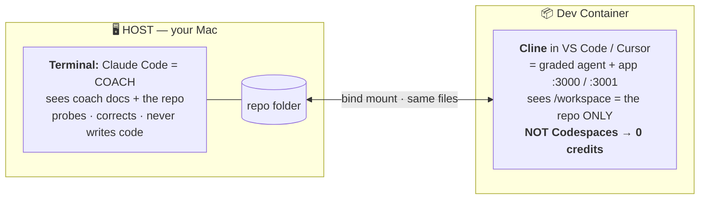
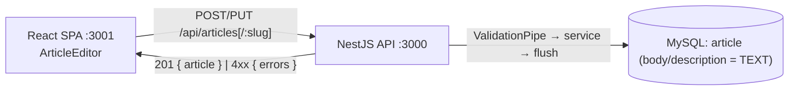

<!-- ===========================================================================
AGENT CONTRACT — SESSION CONTENT (03-TUTORIAL.md)
GOVERNED BY: 00-SYSTEM.md (Invariants + routing). Cited rules: [Inv.N].
ROLE: Everything specific to THIS coaching session.
SOURCE OF TRUTH FOR: the user stories + ACs · the mechanics quiz (every question, group, clue,
  expected answer) · per-step checks/tips · the time budget · the scoring rules (5 criteria +
  star definitions + BASIC/ADVANCED triage) · the opening script · the debrief.
PUT HERE:
  - New/changed questions, clues, tips, ACs, scoring rules, session script.
  - A fact MAY be restated for the session, but it must ALREADY exist in 01-COACH.md — never
    introduce a net-new technical fact here; add it to 01-COACH.md first [Inv.1].
DO NOT PUT HERE:
  - Net-new technical facts (define in 01-COACH.md first)
  - How to phrase questions / grades                          -> 02-VOICE.md
  - Session sequencing / pointers                             -> 04-PROMPT.md
EDIT POLICY:
  - PLACE BY LOCALITY [Inv.4]: a new quiz question goes into its concept group; a new step into
    its build phase. The end is right only when locality lands there.
  - Renumbering questions/steps/counts triggers the cross-file number sweep [Inv.5].
============================================================================ -->

# 03-TUTORIAL — Extend articles end-to-end by directing Cline

## 🧭 Operating model — read this first

**Host = Coach · Dev Container = Coachee.** Run the **coach** (Claude Code) in a plain host
**Terminal**; do the hands-on build with **Cline inside a local Dev Container — _not_ Codespaces**
(keeps your free GitHub credits). The repo is bind-mounted, so the coach on the host sees Cline's
edits live.



---

> **How to use this.** This is learn-by-doing on the **real article files** — the main path the
> exam grades. You'll extend the existing article create/edit flow by **directing Cline**, layer
> by layer, following this repo's own patterns. Each step is **Study → Build → Verify**: read the
> existing reference code, write the Cline prompt, then confirm it works before moving on.
>
> The point is not the feature. The point is to run the exact loop you'll run in the exam —
> plan, direct the AI with file context, review every diff — until the 8 concepts in
> `01-COACH.md` are muscle memory.

---

## Context — what you're extending (read first)

**The app.** This is **Conduit**, the reference build of **"RealWorld"** — a **Medium.com
clone**, i.e. a social blogging platform. Users register/log in, then **publish, read, edit,
and delete articles** (title, description, body, tags). Articles are addressed by a URL **slug**.
Every article-scoped endpoint is `/api/articles/:slug/...`. (Full product + stack rationale:
`01-COACH.md §2`.)

**Why this feature, and how it maps to the exam.** The README fixes the theme — the hidden story
is *"around creating and editing articles, requiring you to change the data model and introduce a
new technical pattern."* The exact acceptance criteria are revealed only when your timer starts.
This tutorial is a **grounded proxy**: it runs those two muscles on the real article files, so
the moves transfer directly. It is *not* a guarantee of the revealed ACs — it's the most
defensible practice target given the two signals visible in the code today:

- `article.body` and `article.description` are `varchar(255)` — `InitialMigration.ts:21`; the
  entity declares them plain string — `article.entity.ts:28,31`. **Long bodies overflow** →
  your data-model change.
- Article create/edit **validate nothing** — `CreateArticleDto` has no decorators
  (`create-article.dto.ts`); `article.controller.ts` `create`/`update` bind it with **no
  `@UsePipes`** (only `user.controller.ts` validates) → your new pattern, for articles.

**The practice user stories** (the same two the coaching prompt opens with):
> 1. **Long-form articles** — *As an author, I can write an article whose body runs longer than
>    today's 255-char limit, so a full post isn't cut off.*
> 2. **Validated submissions** — *As an author, when I submit an article with an empty title or
>    body, the app rejects it with a clear, field-level error, so I know exactly what to fix.*

**Acceptance criteria:**
1. `POST /api/articles` and `PUT /api/articles/:slug` accept a body well over 255 chars; it
   persists and reads back intact (round-trips across a restart).
2. Both endpoints reject an empty `title` or `body` with a field-level error (the stock pipe
   returns `HttpStatus.BAD_REQUEST` — see the suggested `422` refactor in the plan note below).
3. The error surfaces in the article editor UI (no silent failure).
4. Both endpoints still require auth (already wired — verify, don't re-add).

**The exam shape this drills.** Unlike a from-scratch feature, almost everything here is
**modifying existing code** — and several layers already do what you need. Recognizing when the
wiring already suffices is itself a graded judgment. The two genuinely-new moves are an
**ALTER TABLE migration** and **turning on validation for articles**.



---

## Build order — backend-first, then verify, then frontend

On the backend each layer needs the one before it, so you build **bottom-up**; you then **verify
the backend on its own** (curl/Swagger) before touching the UI, because FE↔BE are decoupled only
by the HTTP contract. (Full principle: `01-COACH.md §5`.)

> **Each "Build — prompt Cline" block below is the *implementation* prompt.** Per
> `02-VOICE.md`, run a **context-gathering** Cline pass first — direct Cline to inspect the
> referenced files and report back, making **no** changes — before you send the build prompt.
>
> **Run every Cline interaction through the approval discipline:** `prompt → review the command/edit
> Cline proposes → reject & refine if wrong (e.g. an escaped `&amp;&amp;` or a chained command) →
> approve → review the response`. Don't blind-auto-approve command execution — the review step is
> where you catch a command Cline would mangle. Full discipline + the operator-free fix:
> `01-COACH.md` §2.8.

| Build step | Layer | COACH concept | New code, or verify-only? |
|---|---|---|---|
| 1 | Entity + ALTER migration (+ register both) | **3** | **Modify** entity, **new** migration |
| 2 | DTO validation | **5** | **Modify** `CreateArticleDto` |
| 3 | Controller `@UsePipes` on create **and** update | **5** | **Modify** controller |
| 4 | Module auth + service UoW | **4** + **2** | **Verify-only** (already wired) |
| — | **VERIFY BACKEND** (curl / Swagger) | — | — |
| 5 | FE type + decoder + `conduit` API | **7** | **Verify-only** (`Result` already there) |
| 6 | Redux slice (`errors` state) | **6** | **Verify-only** (`editor` slice already there) |
| 7 | Editor page renders the error | **8** | **Verify-only / minor** |

> **Before you touch code: write the plan.** An absent plan = 0 stars. Open `plan.md` at the repo
> root (the file the exam grades and `submit.ts` zips; Cline reaches it as `@plan.md`) and fill
> Plan / Decisions / Notes in your own words. Three Decisions worth recording: (a) `TEXT` vs
> `varchar(255)` for body/description — alternative: truncate at 255, rejected (data loss);
> (b) validation as an opt-in `@UsePipes` per handler vs a global pipe — match the repo's
> per-handler style; (c) **suggested refactor** — the stock pipe returns `HttpStatus.BAD_REQUEST`
> on validation failure, but the RealWorld convention is `HttpStatus.UNPROCESSABLE_ENTITY` (422);
> record the decision here and direct Cline to apply it (it's shared with the user endpoints, so
> they'd return `422` too). AWS note: the change lives in Aurora, no in-memory state → multi-instance
> safe.
>
> **Delegated context counts only when recorded.** When you have Cline gather a fact (e.g. grep
> which handlers share the `ValidationPipe`), the gather is AI Usage — but the *Plan Soundness*
> credit comes from **your decision** written here (e.g. "422 across the user endpoints too is the
> RealWorld convention → acceptable"). Per `02-VOICE.md` §"Reward delegating recall":
> gathered-but-unrecorded scores nothing.

---

## Opening — deliver verbatim

Hi! I'm your AI-Augmented Design and Implementation Coach.

**Conduit** is a Medium-style blogging platform — a full-stack app built with React + TypeScript +
NestJS + MikroORM + MySQL, deployed on AWS. The current MVP lets users:
- register, log in, and log out
- publish, read, edit, and delete articles
- comment on articles
- favorite articles
- follow authors
- browse articles by tag

Post-MVP, we have two improvements to ship. Over the next ~4 hours we'll design and implement them
together, as user stories:
- **Long-form articles** — *As an author, I can write an article whose body runs longer than
  today's limit, so a full post isn't cut off.*
- **Validated submissions** — *As an author, when I submit an article with an empty title or body,
  the app rejects it with a clear, field-level error, so I know exactly what to fix.*

I'll evaluate you on 5 criteria:
- **Plan Soundness**
- **Code Quality**
- **Correctness**
- **AI Usage**
- **Velocity**

**Time budget:**
- `0:30` — Write your plan in `plan.md`
- `0:45` — Data model changes + related frontend
- `1:30` — New technical pattern + related backend and frontend
- `0:15` — Run acceptance tests, screenshots, submit

Cline is your agentic partner. **Planning and orchestrating Cline are heavily weighted.**

Before we start, a quick quiz — to confirm you've got the coaching dynamics and to gauge your
familiarity with the stack touch points we'll work on. If you're shaky on something, I'll point you
to the reference in `01-COACH.md`. When you decide you're ready, we move to the implementation.

Ready? Let's start.

> **Coach note (do not read aloud):** deliver the above without adding rubric-star definitions,
> "what 3 stars looks like" monologues, proxy-vs-real-AC caveats, or any explanation of *why* these
> stories were chosen. Hold that as your own knowledge (see the Context section above and
> `01-COACH.md` §7); apply it when
> scoring. Never self-justify ("that's my job"). Per `02-VOICE.md` Tone rules.

---

## Mechanics Quiz

Run all 12 questions before moving past the quiz. You have stated the *story* — the two user
stories in business terms. **Q1** and **Q2** ask the candidate to derive the technical change each
story requires (and cite the file that proves the gap). **Q3–Q12** then test whether the candidate
understands the *mechanics* to ship those changes correctly. Ask one at a time. Score it. Correct
wrong answers before moving on — but never hand over a technical change the candidate should
derive; point at the file and make them produce it. Do NOT advance past the quiz until all 12 are
answered correctly.

Record each resolved exchange per `02-VOICE.md` §"Quiz discipline" item 6. For this package the
bank is the sibling folder `coach-ws-eng-conduit-ai-assessment-quizz-chat/`, with **a new `takeN/`
subfolder per session** (`take1/`, `take2/`, …) — one `Q0N.md` per question, never overwriting a
prior take.

The questions are MECE across every domain this story touches. Group labels are for your
reference — don't show them to the candidate.

---

**[A — Story → technical change, derived by the candidate]**

**Q1.** The first story: authors writing **long-form articles**.

> *As an author, I can write an article whose body runs longer than today's 255-char limit, so a
> full post isn't cut off.*

Name the technical change it requires, explain why the story demands it, and name the file that
proves the gap exists today.

> Expected: Long-form bodies need TEXT because the column is `varchar(255)` —
> `InitialMigration.ts:21`, entity `article.entity.ts:28,31`. If they name the symptom but not
> the file, mark incomplete — point at the migration and make them read the DDL. If they can't
> name TEXT as the fix, point at the file; don't supply the type.

---

**Q2.** The second story: the app **rejecting invalid submissions**.

> *As an author, when I submit an article with an empty title or body, the app rejects it with a
> clear, field-level error, so I know exactly what to fix.*

Name the technical change it requires, explain why the story demands it, and name the file(s) that
prove the gap.

> Expected: Validation is missing because `CreateArticleDto` has no class-validator decorators
> and the create/update handlers have no `@UsePipes` — `create-article.dto.ts`,
> `article.controller.ts`. If they can't name the file, point at it; don't supply the technical
> change.

---

**[B1 — Data model: entity vs DB]**

**Q3.** You change `Article.body` from `@Property({ fieldName: 'body' })` (string) to
`@Property({ type: 'text', fieldName: 'body' })` in `article.entity.ts` and restart the
backend. Does the MySQL column change? Yes or no, and exactly why?

> Expected: No. The entity change tells MikroORM the *desired* shape. The DB column only
> changes when a migration with the matching DDL runs. Without a migration, the DB is untouched.

---

**[B2 — Migrations: registration gotcha]**

**Q4.** You write `backend/src/migrations/AlterArticleBodyDescriptionToText.ts` with the correct
`ALTER TABLE` DDL. You restart the backend. The migration does not run. What's missing, and
in which file?

> Expected: It must be added to `migrationsList` in `backend/mikro-orm.config.ts`.
> `discovery: { disableDynamicFileAccess: true }` means no glob discovery — explicit
> registration only.

---

**[B3 — Migration DDL: review the generated migration]**

**Q5.** After changing the entity, `npx mikro-orm migration:create --name AlterArticleBodyDescriptionToText`
emits this (verbatim, captured from a real run against the seeded DB). You're reviewing what the
tool generated before it ships. **Ship as-is, fix, or reject — and justify your verdict.**
*(Angle: this question is about reviewing AI/CLI-generated output — not the registration mechanic,
which Q4 already covered.)*

```ts
async up(): Promise<void> {
  this.addSql('alter table `article` modify `description` text not null, modify `body` text not null;');
}
async down(): Promise<void> {
  this.addSql('alter table `article` modify `description` varchar(255) not null, modify `body` varchar(255) not null;');
}
```

> Expected: **Ship the SQL.** The DDL is correct: `ALTER … MODIFY` (the table exists, so not
> CREATE/DROP), target type `text`, both columns, non-null (matches the entity), and a `down()` that
> reverts to `varchar(255)`. The candidate must demonstrate **recognition** of that — not recall.
> The strongest reviewers flag the `down()` hazard: once long bodies exist, reverting
> `text`→`varchar(255)` errors in strict mode (Error 1406) — so the rollback isn't safe to assume,
> and "fixing" it by pre-trimming rows to fit is *data loss* (usually accepted as a migration
> limitation, not silently patched). Also good if they note that `migration:create` wrote a
> `.snapshot-conduit.json`, and that a *drifted* schema could make the diff emit extra DDL — which
> is exactly why the human review matters. Reviewing AI/CLI-generated output is the AI Usage skill;
> writing DDL cold is not graded.
> **MECE guard:** registration in `migrationsList` is **Q4's** territory — do **not** re-ask or
> grade it here; if the candidate volunteers it, acknowledge briefly and stay on the review angle.

---

**[C1 — Validation: opt-in pipe]**

**Q6.** You add `@IsNotEmpty()` to `CreateArticleDto`. An empty body is still accepted. What
single thing is missing from the controller, and where exactly does it go?

> Expected: `@UsePipes(new ValidationPipe())` on the handler method (not the class, not
> globally) — and on **both** `create` and `update`, since both bind `CreateArticleDto`. Import
> the repo's own pipe from `shared/pipes/validation.pipe.ts` — not `@nestjs/common`'s version.
> Bonus: that pipe returns `HttpStatus.BAD_REQUEST` (400) on failure; refactoring it to
> `HttpStatus.UNPROCESSABLE_ENTITY` (422, the RealWorld convention) is a suggested `plan.md`
> decision to execute via Cline — note it's shared with the user endpoints.

---

**[C2 — Auth: middleware wiring]**

**Q7.** Confirm the create/edit routes are already auth-protected, and name where. If you added a
brand-new article sub-route, which file and method call would protect it?

> Expected: `article.module.ts` `configure(consumer)` already applies `AuthMiddleware` to
> `POST /articles` and `PUT /articles/:slug`. A new protected route is added to the same
> `consumer.apply(AuthMiddleware).forRoutes(...)` chain, e.g.
> `{ path: 'articles/:slug', method: RequestMethod.PUT }`.

---

**[D — AWS: stateless constraint]**

**Q8.** To "validate uniqueness of titles" you keep a module-level `const seenTitles: string[] = []`
and push to it on every create. Works in local dev. In production on ECS with 3 instances, what
breaks, and what is the fix?

> Expected: Each instance has its own copy — writes on instance A are invisible to B and C.
> Fix: enforce it in Aurora (unique constraint / query), nothing durable in process memory.
>
> **Second-order — DO NOT REVEAL; pull it only *after* they give the DB-constraint fix.** The DB
> `unique` constraint fixes *integrity*, but alone it surfaces as an unhandled **500**, not a
> field-level error — so "enforce in Aurora" is necessary, not sufficient. A strong candidate
> recognizes the missing **catch-and-translate** step (MikroORM `UniqueConstraintViolationException`
> → the `{ errors: { field: [...] } }` shape the editor decodes) and treats it as a *new technical
> pattern* to design. Grade it on the existing criteria — **Correctness** (a clean field error,
> never a 500), **Code Quality** (proper exception handling, not a swallowed catch), and **Plan
> Soundness** (the option chosen + its trade-off recorded in `plan.md`). Pull, don't tell:
> "unhandled, what status does the duplicate return — 400, or something else? and how does the field
> error reach the editor?" Do **not** enumerate the fix — make them derive it; the gap + the three
> options and their trade-offs live in `01-COACH.md §7` item 6. Exception-handling is a prime
> candidate for whatever "new technical pattern" the real story names — rehearse it here.

---

**[E1 — Frontend: API layer patterns]**

**Q9.** `conduit.ts` has two patterns: some functions return a plain decoded value (throw on
error), others return `Result<T, GenericErrors>`. Which do `createArticle`/`updateArticle` use,
and why is that the right choice for this story?

> Expected: `Result<T, GenericErrors>` — they're mutations that can fail with user-facing
> field-level errors, so the editor can display them via `.match({ ok, err })` without a
> try/catch. (Queries that only fail on network/decode errors return the plain value + throw.)

---

**[E2 — Frontend↔Backend: the error-shape contract (highest-signal senior trace)]**

**Q10.** AC3 says a rejected submit must show a **field-level error in the editor**. The backend pipe
is wired (`@UsePipes`), and `createArticle` returns `Result<Article, GenericErrors>`. A user submits
an empty title; the backend responds `400` with an `errors` body.

Trace that error from the backend's `ValidationPipe.buildError`, through `genericErrorsDecoder`, to
the `<Errors>` component — and answer: **does the field error actually render, or not?** Justify
every hop from the real code. (Do **not** assume "the MVP shipped, so it works.")

> **What this question really tests** — the gold-standard senior-fullstack signal: reading **both**
> ends of a contract in an unfamiliar stack (NestJS + the `Result` monad + `decoders`) and committing
> to a verdict **under uncertainty** instead of guessing. Run it per `02-VOICE.md` §"The highest-signal
> exercise". Make them read each hop and commit; never hand the mismatch over.
>
> Expected (the path is **broken** today — three shapes disagree):
> - `buildError` (`backend/src/shared/pipes/validation.pipe.ts`) emits `Record<string, string>`:
>   value is a **string**, key is `field+constraintName` (`titleisNotEmpty`). Live-captured:
>   `{"errors":{"usernameisNotEmpty":"username should not be empty", …}}`.
> - `genericErrorsDecoder = dict(array(string))` (`frontend/src/types/error.ts:3,5`) requires each
>   value to be a **`string[]`**; `<Errors>` (`frontend/src/components/Errors/Errors.tsx:6-9`) calls
>   `fieldErrors.map(...)`, so it *also* assumes arrays and prints the compound key verbatim (no
>   unwrap to `title`).
> - `decoders` does **not** coerce: `array(string).verify("…")` **throws**. That throw fires *inside*
>   the `catch` of `createArticle`/`updateArticle` (`conduit.ts:84,99`), so it escapes unhandled,
>   `.match({ err })` never runs, the field error never renders → **AC3 fails**.
>
> The clinching insight: `login`/`signUp`/`updateSettings` (`conduit.ts:41,64,74`) share the *same*
> decode + the *same* pipe → the **shipped MVP's** user validation carries the same latent bug.
> **"It shipped" is not "it works"** — nobody exercised it with empty input. **Reward** the candidate
> who *distrusts* that assumption and verifies the shapes; **mark down** "it probably works since it
> shipped." Fix (a `plan.md` Decision): `buildError` emits `{ [field]: [message] }` — `string[]` keyed
> by the **bare field** — shared-pipe blast radius that also fixes the user endpoints. Full write-up:
> `01-COACH.md §2.5` (the confirmed-seam caveat).
> **MECE guard:** Q9 is *which pattern & why* (`Result` vs throw); **this** is *does the concrete shape
> flow end-to-end* — a distinct angle, do not collapse them.

---

**[E3 — Frontend: runtime decoder]**

**Q11.** *(Set the ground first, out loud: this is **frontend-only**. The frontend keeps its **own**
`Article` interface + `articleDecoder` (Concept 7), separate from the backend entity / `IArticleRO` —
coupled only by the HTTP JSON. No backend file is in scope here.)*

The real story adds a `subtitle: string` field. On the **frontend**, in
`frontend/src/types/article.ts`, you add `subtitle` to the `Article` interface **and** declare it
**required** (`subtitle: string`) in `articleDecoder`. The backend's JSON response does **not**
include `subtitle` yet. A page calls `getArticles()` and loads — what happens at runtime, and why?
Then: the fix, and the debt it creates.

> Expected: `articleDecoder.verify(data)` throws — `subtitle` is declared required `string` but is
> `undefined` in the response, so the decode fails and the page errors. Fix: make it
> `optional(string)` in the decoder until the backend ships the field. Debt: `optional()` is a
> temporary tolerance — record a Definition-of-Done line in `plan.md` ("tighten `subtitle` to
> required once the backend returns it") and clear it in the verify pass.
> **Don't trap — set the ground.** Two `Article` types exist (backend entity vs this frontend
> interface). Name the frontend side explicitly *before* the ask; do **not** let "the backend doesn't
> return it" pull the candidate toward `backend/src/article/article.interface.ts`. Hinging the answer
> on catching a single qualifier is a riddle, not a coaching prompt (`02-VOICE.md`).

---

**[F — AI Usage: Cline prompt quality]**

**Q12.** You want to add `@IsNotEmpty()` to `CreateArticleDto` and `@UsePipes` to the article
create/edit handlers. Your Cline prompt is: *"Add validation to article creation."*

Is this a strong or weak prompt for directing Cline? Say why — then rewrite it to be strong.

> Expected: weak — vague, no file context, no reference pattern.
> 3-star rewrite must include: @-mention of `create-article.dto.ts`, @-mention of the reference
> DTO that already uses decorators (`create-user.dto.ts`), @-mention of `article.controller.ts`,
> explicit instruction to apply `@UsePipes` to **both** create and update, and to use the repo's
> own `ValidationPipe` from `shared/pipes/validation.pipe.ts`, not the NestJS default.

---

## 1. Step 1 — Entity + ALTER migration  (Concept 3)

**Study.** `backend/src/article/article.entity.ts:28,31` — `description` and `body` are plain
`@Property({ fieldName: ... })` strings. `backend/src/migrations/InitialMigration.ts:21` — the
`article` table DDL declares both `varchar(255)`. `backend/mikro-orm.config.ts` — entities and
`migrationsList` are **hand-registered** (no glob).

**Build — prompt Cline (entity):**
> "In @backend/src/article/article.entity.ts change the `body` and `description` properties to
> MySQL TEXT: `@Property({ type: 'text', fieldName: 'body' })` and the same for `description`.
> Don't touch anything else."

**Build — prompt Cline (migration):**
> "Create `backend/src/migrations/AlterArticleBodyDescriptionToText.ts` following the structure of
> @backend/src/migrations/InitialMigration.ts. The `article` table already exists, so `up()` must
> use **ALTER TABLE ... MODIFY**, not CREATE TABLE:
> `ALTER TABLE \`article\` MODIFY \`body\` text NOT NULL;` and the same for `description`.
> Add a `down()` that reverts both to `varchar(255)`."

> **Hand-write or `npx mikro-orm migration:create`?** The CLI *can* auto-generate this by diffing
> your entity change against the live DB. Two of the three original friction points have been fixed
> in `backend/mikro-orm.config.ts`; one remains:
> - ✅ **path** — `migrations.pathTs` is now `join(__dirname, 'src', 'migrations')` → the file
>   lands in `backend/src/migrations/` where it belongs.
> - ✅ **name** — pass `--name AlterArticleBodyDescriptionToText`; the CLI produces
>   `Migration<timestamp>_AlterArticleBodyDescriptionToText.ts` (timestamp prefix kept for ordering).
>   ```bash
>   npx mikro-orm migration:create --name AlterArticleBodyDescriptionToText
>   ```
> - ❌ **auto-registration** — still manual: add the generated class to `migrationsList` in
>   `backend/mikro-orm.config.ts` (next block). `migrationsList` is hand-maintained by design
>   (bundle-safe); the CLI never edits it.
>
> Remaining caveat: the DB must be running when you call `migration:create` — it diffs entity
> metadata against the `.snapshot-conduit.json` (in `src/migrations/`) if present, else the live
> schema, and writes/updates that snapshot. For the `body`→TEXT change it emits a **clean**
> `alter table article modify body text not null` (+ a `down()` to `varchar(255)`) — *verified
> 2026-06-12, no spurious DDL.* ⚠️ **Retraction:** an earlier version of this note claimed a
> "confirmed" unique-index drift on `title`/`slug`; that **did not reproduce** (the live `article`
> table has no such indexes) and is withdrawn. The durable point: a *genuinely* drifted schema can
> emit extra DDL, so **always review the generated migration before shipping** (the Q5 skill) — the
> review is the guard, not a specific predicted drift.
> (Which CLI command reads entities vs the live DB vs writes: table in `01-COACH.md` §2.8.)
>
> **Verified output** (real run, `migration:create` against the seeded DB after the entity change):
> ```ts
> async up(): Promise<void> {
>   this.addSql('alter table `article` modify `description` text not null, modify `body` text not null;');
> }
> async down(): Promise<void> {
>   this.addSql('alter table `article` modify `description` varchar(255) not null, modify `body` varchar(255) not null;');
> }
> ```
> Note it emits **one combined `addSql`** (both columns), correct `ALTER … MODIFY`, `not null`
> (matches the entity), and an auto-generated `down()`. The hand-written prompt above splits it into
> two statements — both are valid; review for *correct shape*, not exact phrasing.

**Build — register both (the gotcha):**
> "In @backend/mikro-orm.config.ts add the new migration to `migrationsList`, matching how
> `InitialMigration` is listed. The entity is already in `entities`."

**Verify (via Cline, not your terminal).** Restart the backend; migrations auto-run on boot.
Direct Cline to read the **live DB type** — the Cline-runnable move is
*"run `npx mikro-orm generate-entities --dump` from `backend/` and report the `body`/`description`
mapping for `Article` (a `columnType: 'text'` = the migration hit the DB)."* Want the literal SQL
DDL? Have Cline **write a one-line `.sh`** with the `mysql2`/`node` read and run *that* — pasting the
`SHOW CREATE TABLE` one-liner inline fails (Cline HTML-escapes its quotes). **Don't "verify" with
`schema:create --dump`** — it reads the entity, so it shows `text` even if you forgot `migrationsList`
and the DB never changed (false pass). Pick by live-coding fit: `01-COACH.md` §2.8 table.
If nothing changed, you forgot `migrationsList`.

> **Quick schema sanity without a `mysql` client** (the dev container has none): inspect what your
> *entity* declares with
> `npx mikro-orm schema:create --dump | grep -E "create.*\`article\`"`. Use `.*`, **not** a literal
> space — the dump is color-coded, so `grep "create table"` matches nothing (escape codes on the
> space), and **`NO_COLOR=1` is a no-go under exam time** (too low-level to fiddle with live; `.*`
> just works). **`--dump` ≠ "dump the database":** this is the **entity-derived** schema (it flips to
> `text` the instant you edit the entity, before any migration runs) — *not* the live DB. The live
> confirmation is the round-trip below. Which CLI command reads entities vs the live DB vs writes —
> and the direct live-read options: `01-COACH.md` §2.8.

> ✅ **Check:** why does writing `AlterArticle...ts` alone do nothing until you edit
> `mikro-orm.config.ts`? (Concept 3: migrations are hand-registered, not glob-discovered.)
> And why is this an ALTER, not a CREATE? (The table already exists — CREATE would fail / DROP
> would destroy data.)

---

## 2. Step 2 — DTO validation  (Concept 5)

**Study.** Two contrasting references: `backend/src/article/dto/create-article.dto.ts` (no
validators — used by **both** create and update) and `backend/src/user/dto/create-user.dto.ts`
(uses `@IsNotEmpty()`). Article endpoints validate nothing today.

**Build — prompt Cline:**
> "In @backend/src/article/dto/create-article.dto.ts add `@IsNotEmpty()` from class-validator to
> the `title` and `body` fields, matching the validator style in
> @backend/src/user/dto/create-user.dto.ts. Leave `description` and `tagList` as-is."

**Verify.** Nothing runs yet — the decorator does nothing until the pipe is wired in Step 3.

> ✅ **Check:** does adding `@IsNotEmpty()` enforce anything on its own here? (No — Concept 5: the
> `ValidationPipe` is opt-in per handler with `@UsePipes`. Step 3 wires it.)

---

## 3. Step 3 — Controller pipe on create AND update  (Concept 5)

**Study.** `backend/src/article/article.controller.ts` — `create` (`@Post()`) and `update`
(`@Put(':slug')`) both bind `@Body('article') ...: CreateArticleDto` and **neither** has
`@UsePipes`. `backend/src/shared/pipes/validation.pipe.ts` is the repo's own pipe (rejects empty
body, flattens errors to `{ field: message }`) — **not** `@nestjs/common`'s. It throws
`HttpStatus.BAD_REQUEST` on failure; refactoring that to `HttpStatus.UNPROCESSABLE_ENTITY` (422,
the RealWorld convention) is a **suggested** improvement to record in `plan.md` and have Cline
execute (see the plan note above) — not a required step here.

**Build — prompt Cline:**
> "In @backend/src/article/article.controller.ts apply `@UsePipes(new ValidationPipe())` to
> **both** the `create` and `update` handlers, importing `ValidationPipe` from
> @backend/src/shared/pipes/validation.pipe.ts (NOT from `@nestjs/common`). Match the way
> @backend/src/user/user.controller.ts decorates its `create`/`login` handlers."

> **Optional (from your plan):** if you recorded the `422` refactor as a Decision, direct Cline to
> apply it to @backend/src/shared/pipes/validation.pipe.ts now — derive the prompt yourself
> (reference the file, name the `HttpStatus` change, flag that the pipe is shared with the user
> endpoints). It's not required for the ACs below; the stock `HttpStatus.BAD_REQUEST` already
> rejects the bad input.

**Verify.** Reachable after this step (the routes are already registered — see Step 4). You'll
curl them in the backend-verify block below.

> ✅ **Check:** the single most common miss here? (Applying `@UsePipes` to `create` but forgetting
> `update` — so editing still accepts an empty body. Both bind the same DTO; both need the pipe.)

---

## 4. Step 4 — Module auth + service UoW  (Concepts 4 + 2) — verify, don't add

**Study + Verify (no code change expected).**
- `backend/src/article/article.module.ts:22,24` — `AuthMiddleware` is **already** applied to
  `POST /articles` and `PUT /articles/:slug`. Don't re-add it.
- `backend/src/article/article.service.ts` — `create` (`:159`) and `update` (`:171`) already call
  `em.flush()`; the TEXT change needs no service edit (you mutate managed entities, flush once).

> ✅ **Check:** recognizing that a layer already does the job is a graded judgment. State out loud:
> "auth is already wired at `article.module.ts:22,24`; the service already flushes — no change."
> Adding a redundant guard or a manual `persist` would be a Code Quality ding.

---

## ✅ VERIFY BACKEND (via Cline — state the command + expected output)

Direct Cline to run these; you hold the context, Cline executes:

> **Drive Cline with operator-free commands.** Cline HTML-escapes shell metacharacters, so `&&`
> chaining and `>` redirects break (`bash: syntax error near unexpected token ';&'`). Send each
> command on its own, use `-o file` not `> file`, and if a step needs `$(…)`/pipes (like the
> multi-line curls below) put it in a `.sh` file Cline runs. Full fact + the DB-inspection options
> when the devcontainer has no `mysql` client: `01-COACH.md` §2.8.

```bash
# token
curl -s -X POST http://localhost:3000/api/users/login \
  -H 'Content-Type: application/json' \
  -d '{"user":{"email":"jcosten0@purevolume.com","password":"password"}}'
```
```bash
TOKEN=...
# (1) long body persists  → expect 201, body returned intact
LONG=$(printf 'x%.0s' {1..600})
curl -s -X POST http://localhost:3000/api/articles \
  -H "Authorization: Token $TOKEN" -H 'Content-Type: application/json' \
  -d "{\"article\":{\"title\":\"Long one\",\"description\":\"d\",\"body\":\"$LONG\",\"tagList\":[]}}"
# (2) empty body rejected  → expect HttpStatus.BAD_REQUEST (400) with a field error (422 if you applied the refactor)
curl -s -X POST http://localhost:3000/api/articles \
  -H "Authorization: Token $TOKEN" -H 'Content-Type: application/json' \
  -d '{"article":{"title":"No body","description":"d","body":"","tagList":[]}}'
# (3) edit also validates  → repeat the empty-body call as PUT /articles/<slug>
```
AC1 = long body round-trips (re-GET it; restart backend and re-GET to prove it persisted).
AC2 = empty body → field error on **both** create and update. **Screenshot each** into
`submission/`.

---

## 5. Step 5 — Frontend API layer  (Concept 7) — verify-only

**Study + Verify.** `frontend/src/services/conduit.ts:78` (`createArticle`) and `:93`
(`updateArticle`) already return `Result<Article, GenericErrors>` — `Ok(decoded article)` on
success, `Err(decoded errors)` on the 4xx. `Article` already has `body`/`description`, so the
decoder needs no change. No edit expected.

> ✅ **Check:** why does this mutation use `Result` rather than a plain throw? (Concept 7: it can
> fail with user-facing field errors the editor must display — `.match({ ok, err })`.)

---

## 6. Step 6 — Redux slice  (Concept 6) — verify-only

**Study + Verify.** `frontend/src/components/ArticleEditor/ArticleEditor.slice.tsx` already holds
`errors` + `submitting` and an `updateErrors` reducer; the editor's submit path dispatches it on
the `Err` branch. No edit expected — async lives in a plain function that `store.dispatch()`s
(no thunks).

---

## 7. Step 7 — Editor renders the error  (Concept 8) — verify / minor

**Study + Verify.** `frontend/src/components/ArticleEditor/ArticleEditor.tsx:10,19` already
destructures `errors` and passes `errors={errors}` to the form. The route already exists
(`/editor`, `/editor/:slug`). No new page or route.

**Verify (exam dress rehearsal).** Log into http://localhost:3001, open the editor, paste a
long body → Save → it persists; reload/edit → it's intact. Clear the body → Save → the field
error shows. **Screenshot the working flow** — no screenshots in `submission/` = 0 stars.

> ✅ **Check:** you've exercised all 8 concepts — but most as *verify-only*. Name which steps were
> new code (1, 2, 3) and which were "the wiring already suffices" (4, 5, 6, 7). That distinction
> is the real-exam skill.

---

## Scoring

### Time budget (3-star Velocity bar)

- `0:30` — Write your plan in `plan.md`
- `0:45` — Data model changes + related frontend
- `1:30` — New technical pattern + related backend and frontend
- `0:15` — Run acceptance tests, screenshots, submit
- **≈ 4 hours total** from when your timer starts

### What each star looks like

> The official rubric uses vague language. The interpretations below are a conservative bar —
> meeting them guarantees 3 stars; the grader may reward slightly less rigorous work too.

| Criterion | 1 star | 2 stars | 3 stars |
|-----------|--------|---------|---------|
| **Plan Soundness** | Plan exists but incomplete or unclear | Some decisions documented, rationale thin or missing | Plan filed before any code; every decision has a stated alternative + rationale (the official rubric says "technical reasons" — alternatives make that concrete); AWS constraint named; no missing steps |
| **Code Quality** | Code works but is messy | Mostly clean with minor issues | Follows existing patterns exactly (naming, decorator style, module structure); no dead code; no console.logs; DTOs validated |
| **Correctness** | Only **BASIC** features work | **ADVANCED** features work with some bugs | All ACs pass including edge cases (empty body rejected, auth enforced, data persists across restart). **Triage rule:** the hidden story distinguishes BASIC from ADVANCED — always implement and verify BASIC requirements before touching ADVANCED ones so a partial run still scores 1 star |
| **AI Usage** | Basic or unclear prompts | @mentions present, reference files cited, but minor issues | Every prompt: @-mentioned reference files + explicit pattern instruction + gotcha stated; every diff reviewed before accepting; Cline directed to run verification — candidate holds the context, Cline executes. The official rubric says "clear, effective, well-guided" — the above is what that looks like in practice |
| **Velocity** | Took several days | Completed in a day or less | Completed in **~4 hours or less** from when the timer starts (official bar). The time budget is 0:30 plan + 0:45 data model + 1:30 new pattern + 0:15 submit = 3h total — finishing inside that leaves a 1h buffer before the 3-star cutoff |

### BASIC vs ADVANCED triage

**Triage rule:** the real story splits ACs into BASIC and ADVANCED — drive BASIC to done first (a
partial run that finishes BASIC scores 1 star; a half-finished ADVANCED run may score 0). Here,
"long body round-trips + empty body rejected" is BASIC; richer rules (length caps, per-field
messages) are ADVANCED.

---

## 8. Debrief — what to internalize for the real run

- **Modify, don't rebuild.** The article story is mostly editing existing files and recognizing
  the wiring that's already there. Adding redundant code costs Code Quality stars.
- **The two new moves** — an **ALTER TABLE MODIFY** migration and **turning on validation for
  articles** — are exactly "change the data model" + "introduce a new technical pattern." Both
  became *Decisions* in your plan.
- **The gotchas bit you on purpose:** registering the migration in `mikro-orm.config.ts`, opt-in
  `@UsePipes` on **both** create and update, the repo's own `ValidationPipe`. Expect the same
  traps live.
- **AI Usage is the graded skill:** every step was "give Cline a reference file via @mention + a
  precise instruction + the gotcha, then review the diff, then have Cline verify." Keep doing
  exactly that. Two parts carry the most weight:
  - **"Model it on X" beats describing it.** @-mention a file that *already does the pattern*
    (`@create-user.dto.ts` for the `@IsNotEmpty()` style, `@user.controller.ts` for `@UsePipes`
    placement) so Cline copies a proven shape instead of inventing conventions.
  - **State the gotcha explicitly** — e.g. *import `ValidationPipe` from
    `shared/pipes/validation.pipe.ts`, NOT `@nestjs/common`*. Describing the pattern without a
    reference file or without the gotcha caps the prompt at 2 stars.
- **Stateless check:** the change lives in Aurora, nothing in process memory → multi-instance
  safe by construction. Make that an explicit line in your plan's Notes.
- **Debt introduced → Definition-of-Done line in `plan.md`.** Any time you take a reversible
  shortcut — a decoder field made `optional()` to ship the frontend ahead of the backend, a flag
  left on, a stubbed value — record a one-line Definition of Done / acceptance item in `plan.md`
  Notes ("tighten `subtitle` to required once backend ships it") and clear it in the 0:15
  verify/submit pass. It scores on Plan Soundness, and clearing it protects Code Quality and
  Correctness. Don't park the reminder in Cline's memory — you hold the context; the plan is the
  durable home. (Backend-first build order usually means you never create this debt at all.)

When you can run these steps directing Cline without re-reading this file, you're ready. When
done, stop the Dev Container; the MySQL volume persists, so your data survives to next session.

---

## Debrief — final score output

After the build is complete, deliver a final score across all 5 criteria:

```
Plan Soundness:  X/3  — [what was missing or excellent]
Code Quality:    X/3  — [specific pattern violations or strengths]
Correctness:     X/3  — [which ACs passed/failed; note BASIC vs ADVANCED split]
AI Usage:        X/3  — [quality of Cline prompts, use of @mentions, gotcha stated, diff reviewed, Cline ran verification]
Velocity:        X/3  — [time taken; 3-star bar is ~4h from timer start; 2-star = day or less]
```

Then give the top 2 concrete actions to improve before the real exam:
- "Action 1: [specific drill or habit to fix the weakest criterion]"
- "Action 2: [second weakest or highest-risk gap]"

Do not give more than 2 actions. More than 2 is noise.
